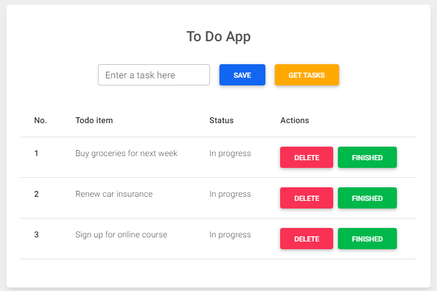

# Теория

- [useState](https://ru.reactjs.org/docs/hooks-reference.html#usestate) (только про `useState`)
- [useEffect](https://ru.reactjs.org/docs/hooks-reference.html#useeffect) (только про `useEffect`)

# Практика

Сделать рабочий `TODO List`

- Добавлять введенную задачу при нажатии `save`
- Кнопка `get task` не делает ничего =)
- При нажатии `finished` статус задачи меняется на `completed` и текст задачи перечеркивается
- При нажатии на `delete` удаляем задачу из списка
- Шаблон
    