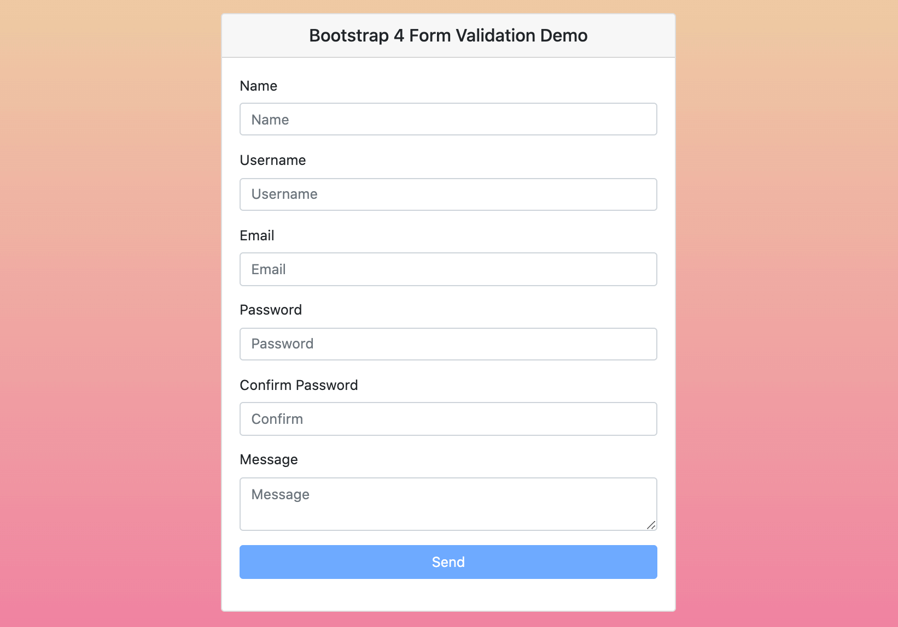

# Теория

- [formik](https://formik.org/docs/overview)
- [yup](https://github.com/jquense/yup)
- [Form validation](https://developer.mozilla.org/ru/docs/Learn/Forms/Form_validation)

# Практика

Сделать валидацию формы

- Name
    - Обязательное поле
    - Длина больше 3 меньше 10
    - Только буквы и пробел
- Username
    - Обязательное поле
    - Длина больше 3 меньше 10
    - Только буквы
- Email
    - Обязательное
    - Правильный еmail
- Password
    - Обязательное
    - Длина больше 5
    - Без пробелов
    - Должно быть минимум 2 спецсимвола
- Confirm Password
    - Должно совпадать с полем password
- Message
    - Не обязательно
    - Длина минимум 10
    - Только буквы, цифры и знаки припенания

Дизайн выдержать максимально близко к картинке

