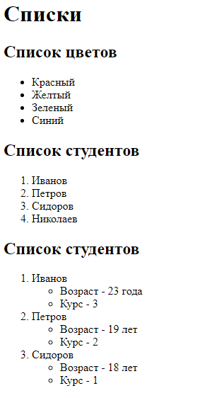
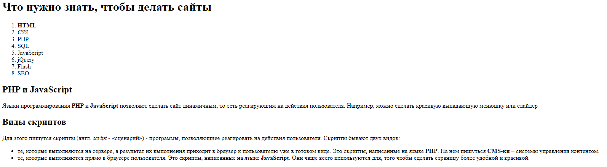

# Теория
> В теории вы можете встретить много непонятного, если мы это не обсуждали на занятии можно смело пропускать. Если возникли вопросы, можете задать их сразу в чате, или на след занятии
- [Редактор кода](https://code.visualstudio.com/)
- [Конспект с занятия](https://msheiko.github.io/js/slides/21.02.22)
- [Введение в HTML(MDN)](https://developer.mozilla.org/ru/docs/Learn/Getting_started_with_the_web/HTML_basics)
- [<!DOCTYPE>](https://doka.guide/html/doctype/)
- [`<html>`](https://doka.guide/html/html/)
- [`<head>`](https://doka.guide/html/head/)
- [`<title>`](https://doka.guide/html/title/)
- [`<body>`](https://doka.guide/html/body/)
- [`<h1-h6>`](https://doka.guide/html/h1-h6/)
- Форматирование
  - [`<p>`](https://doka.guide/html/p/)
  - [`<br>`](https://doka.guide/html/br/)
  - [`<hr>`](https://doka.guide/html/hr/)
  - [`<b>`](https://doka.guide/html/b/)
  - [`<i>`](https://doka.guide/html/i/)
  - [`<s>`](https://doka.guide/html/s/)
  - [`<u>`](https://doka.guide/html/u/)
- [``](https://doka.guide/html/img/) *только то что было на занятии, остальное выучим позже
- [`<a>`](https://doka.guide/html/a/) *только то что было на занятии, остальное выучим позже
- Списки
    - [`<ul>`](https://doka.guide/html/ul/)
    - [`<ol>`](https://doka.guide/html/ol/)
    - [`<li>`](https://doka.guide/html/li/)


# Практика

# Задача 1

Дан текст
```text
Списки
Список цветов
Красный
Желтый
Зеленый
Синий
Список студентов
Иванов
Петров
Сидоров
Николаев
Список студентов
Иванов
Возраст - 23 года
Курс - 3
Петров
Возраст - 19 лет
Курс - 2
Сидоров
Возраст - 18 лет
Курс - 1
```

Сделайте страницу по образцу



# Задача 2

Дан текст

```text
Что нужно знать, чтобы делать сайты
HTML
CSS
PHP
SQL
JavaScript
jQuery
Flash
SEO
PHP и JavaScript
Языки программирования PHP и JavaScript позволяют сделать сайт динамичным, то есть реагирующим на действия пользователя. Например, можно сделать красивую выпадающую менюшку или слайдер

Виды скриптов
Для этого пишутся скрипты (англ. script - «сценарий») - программы, позволяющиее реагировать на действия пользователя. Скрипты бывают двух видов:

те, которые выполняются на сервере, а результат их выполнения приходит в браузер к пользователю уже в готовом виде. Это скрипты, написанные на языке PHP. На нем пишуться CMS-ки – системы управления контентом.
те, которые выполняются прямо в браузере пользователя. Это скрипты, написанные на языке JavaScript. Они чаще всего используются для, того чтобы сделать страницу более удобной и красивой.
```

Сделайте страницу по образцу



# Задача 3

Добавьте на страницу любые 3 картинки, разделенные горизонтальное линией
