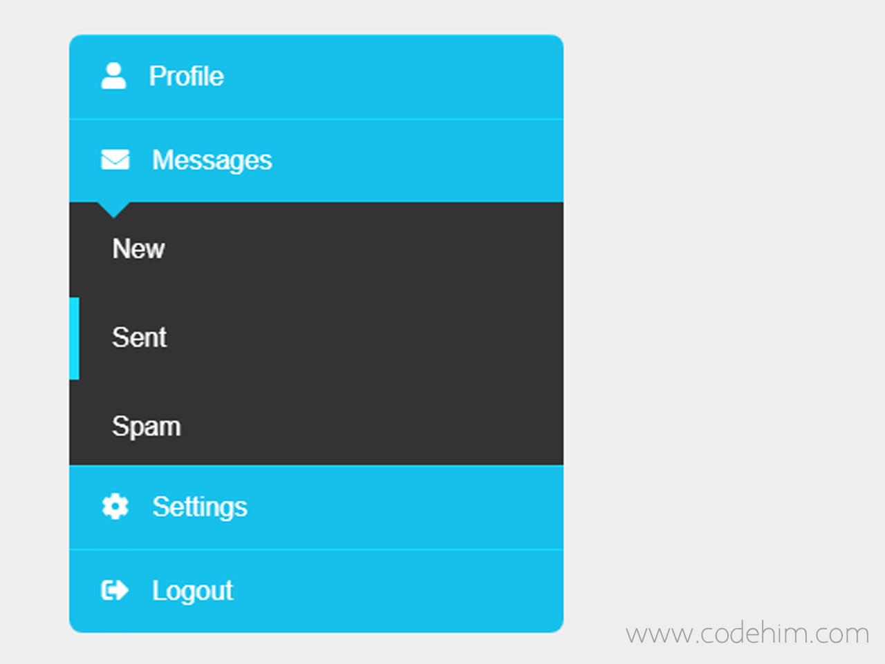

# Теория

- [transition-property](https://doka.guide/css/transition-property/)
- [transition-duration](https://doka.guide/css/transition-duration/)
- [transition-timing-function](https://doka.guide/css/transition-timing-function/)
- [transition-delay](https://doka.guide/css/transition-delay/)
- [transition](https://doka.guide/css/transition/)
- [Выпадающее меню на чистом CSS / HTML](https://dwstroy.ru/video/azbuka-ot-a-do-css/vypadayushchee-menyu-na-css-html/)


# Задание 

Сверстать вертикальное меню

- При наведении на черные вложенные элементы - слева показываем синию полосу
- При наведении на синие элементы - слева показываем черную полосу
- Верхний указатель
    ```css
    ul:before{
    position: absolute;
    content: '';
    width: 20px;
    height: 20px;
    background: #1b1b1b;
    transform: rotate(45deg);
    z-index: -1;
    }
    ```

