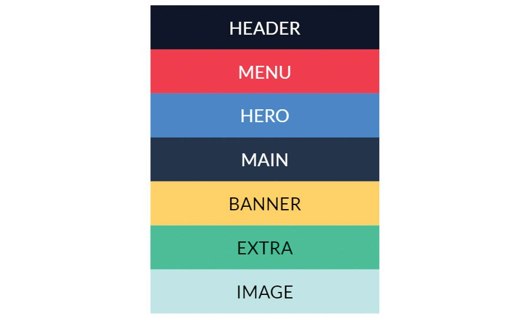
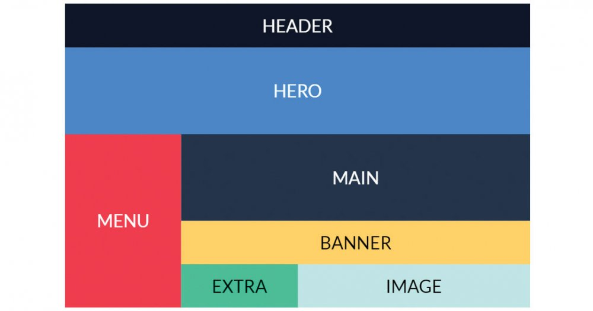
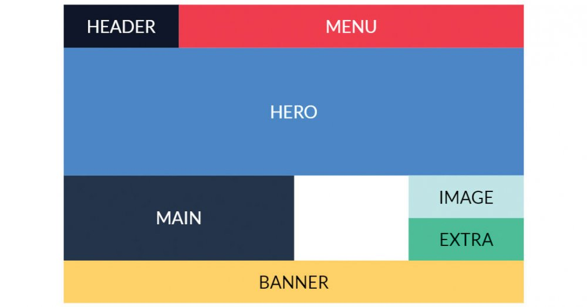
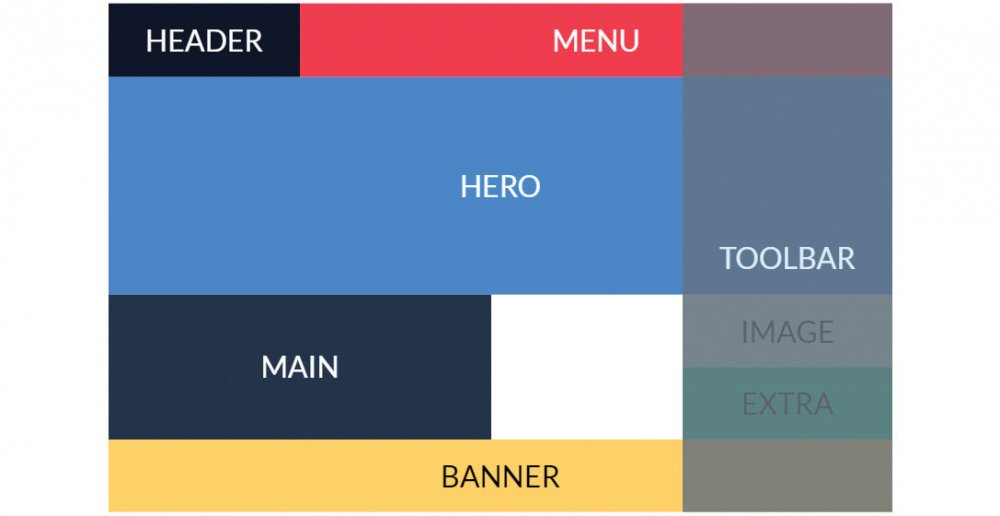

# Теория

- [Гайд по grid](https://doka.guide/css/grid-guide/)
- [Основные понятия Grid Layout](https://developer.mozilla.org/ru/docs/Web/CSS/CSS_Grid_Layout/Basic_Concepts_of_Grid_Layout)
- [grid cheatsheet](https://yoksel.github.io/grid-cheatsheet/)
- [grid cheatsheet 2](https://grid.malven.co/)
- [A Complete Guide to Grid](https://css-tricks.com/snippets/css/complete-guide-grid/)
- [grid](https://doka.guide/css/grid/)
- [grid-area](https://doka.guide/css/grid-area/)
- [grid-auto-columns, grid-auto-rows](https://doka.guide/css/grid-auto-columns-rows/)
- [grid-auto-flow](https://doka.guide/css/grid-auto-flow/)
- [grid-column, grid-row](https://doka.guide/css/grid-column-row/)
- [grid-column-start, grid-column-end, grid-row-start, grid-row-end](https://doka.guide/css/grid-start-end/)
- [grid-template](https://doka.guide/css/grid-template/)
- [grid-template-areas](https://doka.guide/css/grid-template-areas/)
- [grid-template-columns](https://doka.guide/css/grid-template-columns/)
- [grid-template-rows](https://doka.guide/css/grid-template-rows/)
- [column-gap, row-gap](https://doka.guide/css/column-row-gap/)
- [gap](https://doka.guide/css/gap/)

- [var()](https://doka.guide/css/var/)
- [Функции фильтров](https://doka.guide/css/filter-functions/)
- [calc()](https://doka.guide/css/calc/)
- [attr()](https://doka.guide/css/attr/)


# Задача 1

Сверстать на основе `html` 4 версии шаблона

```html
<!DOCTYPE html>
<html lang="en">
  <head>
    <meta charset="UTF-8" />
    <meta http-equiv="X-UA-Compatible" content="IE=edge" />
    <meta name="viewport" content="width=device-width, initial-scale=1.0" />
    <title>Document</title>
  </head>
  <body>
    <div class="container">
      <header>Header</header>
      <nav>Menu</nav>
      <div class="hero">Hero</div>
      <main>Main</main>
      <div class="banner">Banner</div>
      <div class="extra">Extra</div>
      <div class="image">Image</div>
    </div>
  </body>
</html>
```



---



---



---



---
