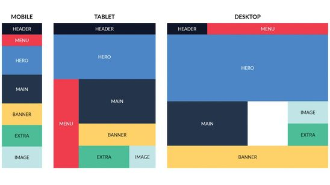

# Теория 

- [@media](https://doka.guide/css/media/)
- [Отзывчивый дизайн](https://developer.mozilla.org/ru/docs/Learn/CSS/CSS_layout/Responsive_Design)
- [Использование медиавыражений](https://developer.mozilla.org/ru/docs/Web/CSS/Media_Queries/Using_media_queries)
- [CSS медиа-запросы (media queries)](https://itchief.ru/html-and-css/media-queries)

# Практика

Сверстать адаптивно шаблон 

