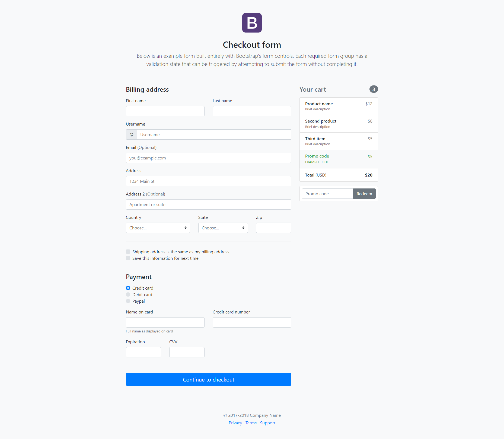
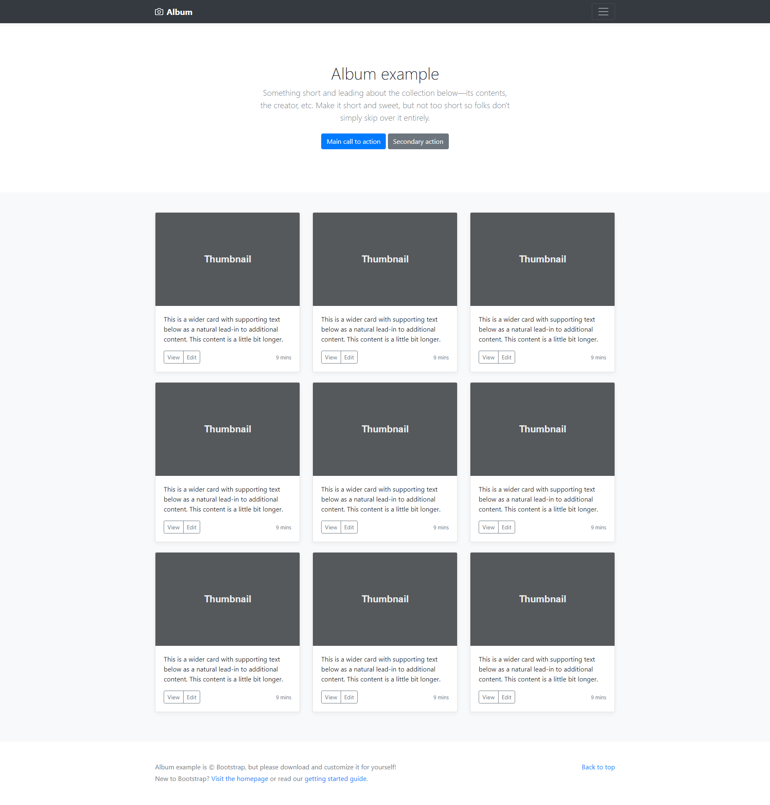

# Теория

- [img](https://doka.guide/html/img/)
- [figure](https://doka.guide/html/figure-figcaption/)
- [picture](https://doka.guide/html/picture/)
- [a](https://doka.guide/html/a/)
- [audio](https://doka.guide/html/audio/)
- [video](https://doka.guide/html/video/)
- [iframe](https://doka.guide/html/iframe/)
- [details](https://doka.guide/html/details/)
- [progress](https://doka.guide/html/progress/)
- [meter](https://doka.guide/html/meter/)
- [Глобальные атрибуты](https://doka.guide/html/global-attrs/)
- [hidden](https://doka.guide/html/hidden/)
- [class](https://doka.guide/html/class/)
- [transform](https://doka.guide/css/transform/)
- [transform-origin](https://doka.guide/css/transform-origin/)
- [transform-style](https://doka.guide/css/transform-style/)

# Практика

# Задача 1

Сверстать шаблон. Каждая страница в отдельном файле

[Шаблон](https://www.figma.com/community/file/1095400336106836499)

# Задача 2

Сверстать на основе Bootstrap

# Задача 3

Сверстать на основе Bootstrap

