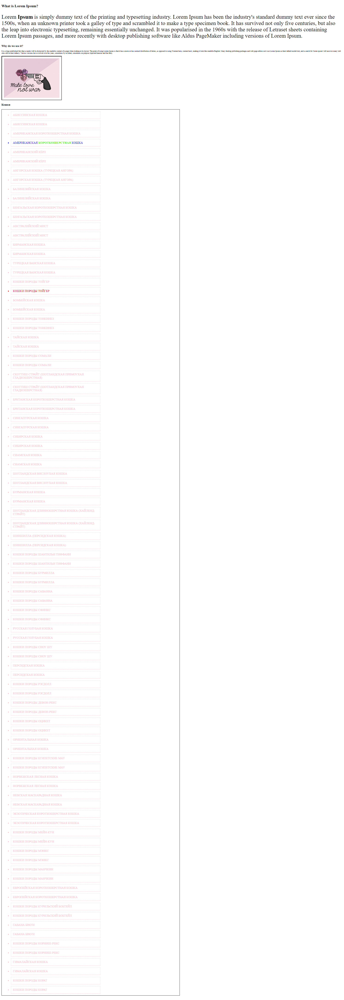

# Теория

- [Блочная модель](https://doka.guide/css/box-model/)
- [Поток документа](https://doka.guide/html/flow/)
- [div](https://doka.guide/html/div/)
- [header](https://doka.guide/html/header/)
- [footer](https://doka.guide/html/footer/)
- [main](https://doka.guide/html/main/)
- [section](https://doka.guide/html/section/)
- [article](https://doka.guide/html/article/)
- [aside](https://doka.guide/html/aside/)
- [nav](https://doka.guide/html/nav/)
- [CSS-правило](https://doka.guide/css/css-rule/)
- [Селектор по тегу](https://doka.guide/css/tag-selector/)
- [Селектор по классу](https://doka.guide/css/class-selector/)
- [Селектор по идентификатору](https://doka.guide/css/id-selector/)
- [Селектор потомка](https://doka.guide/css/nesting-selector/)
- [Специфичность](https://doka.guide/css/specificity/)
- [Цвета ](https://doka.guide/css/web-colors/)
- [Единицы измерения](https://doka.guide/css/numeric-types/)
- [vw, vh, vmin, vmax](https://doka.guide/css/vw-vh/)
- [rem, em](https://doka.guide/css/rem-em/)
- [width](https://doka.guide/css/width/)
- [height](https://doka.guide/css/height/)
- [padding](https://doka.guide/css/padding/)
- [margin](https://doka.guide/css/margin/)
- [color](https://doka.guide/css/color/)
- [background-color](https://doka.guide/css/background-color/)
- [font-size](https://doka.guide/css/font-size/)
- [border](https://doka.guide/css/border/)


# Практика

Дан html

Разрешено писать только стили, структуру `html` кода менять нельзя. Все ваша домашка должна быть внутри тега `<style></styel>`

```html
<!doctype html>
<html lang="en">
<head>
    <title>Document</title>
    <style>

    </style>
</head>
<body>
<h1>What is Lorem Ipsum?</h1>
<p class="first">Lorem <b> Ipsum </b>is simply dummy text of the printing and typesetting industry. Lorem Ipsum has been the industry's standard dummy text ever since the 1500s, when an unknown printer took a galley of type and scrambled it to make a type specimen book. It has survived not only five centuries, but also the leap into electronic typesetting, remaining essentially unchanged. It was popularised in the 1960s with the release of Letraset sheets containing Lorem Ipsum passages, and more recently with desktop publishing software like Aldus PageMaker including versions of Lorem Ipsum.</p>
<h2>Why do we use it?</h2>
<p class="second"> It is a long established fact that a reader will be distracted by the readable content of a page when looking at its layout. The point of using Lorem Ipsum is that it has a more-or-less normal distribution of letters, as opposed to using 'Content here, content here', making it look like readable English. Many desktop publishing packages and web page editors now use Lorem Ipsum as their default model text, and a search for 'lorem ipsum' will uncover many web sites still in their infancy. Various versions have evolved over the years, sometimes by accident, sometimes on purpose (injected humour and the like).</p>


<h2>Кошки</h2>
<ul>
<li>АБИССИНСКАЯ КОШКА</li>
<li>АБИССИНСКАЯ КОШКА</li>
<li>АМЕРИКАНСКАЯ КОРОТКОШЕРСТНАЯ КОШКА</li>
<li class="blue">АМЕРИКАНСКАЯ <b>КОРОТКОШЕРСТНАЯ</b> КОШКА</li>
<li>АМЕРИКАНСКИЙ КЁРЛ</li>
<li>АМЕРИКАНСКИЙ КЁРЛ</li>
<li>АНГОРСКАЯ КОШКА (ТУРЕЦКАЯ АНГОРА)</li>
<li>АНГОРСКАЯ КОШКА (ТУРЕЦКАЯ АНГОРА)</li>
<li>БАЛИНЕЗИЙСКАЯ КОШКА</li>
<li>БАЛИНЕЗИЙСКАЯ КОШКА</li>
<li>БЕНГАЛЬСКАЯ КОРОТКОШЕРСТНАЯ КОШКА</li>
<li>БЕНГАЛЬСКАЯ КОРОТКОШЕРСТНАЯ КОШКА</li>
<li>АВСТРАЛИЙСКИЙ МИСТ</li>
<li>АВСТРАЛИЙСКИЙ МИСТ</li>
<li>БИРМАНСКАЯ КОШКА</li>
<li>БИРМАНСКАЯ КОШКА</li>
<li>ТУРЕЦКАЯ ВАНСКАЯ КОШКА</li>
<li>ТУРЕЦКАЯ ВАНСКАЯ КОШКА</li>
<li>КОШКИ ПОРОДЫ ТОЙГЕР</li>
<li class="red">КОШКИ ПОРОДЫ ТОЙГЕР</li>
<li>БОМБЕЙСКАЯ КОШКА</li>
<li>БОМБЕЙСКАЯ КОШКА</li>
<li>КОШКИ ПОРОДЫ ТОНКИНЕЗ</li>
<li>КОШКИ ПОРОДЫ ТОНКИНЕЗ</li>
<li>ТАЙСКАЯ КОШКА</li>
<li>ТАЙСКАЯ КОШКА</li>
<li>КОШКИ ПОРОДЫ СОМАЛИ</li>
<li>КОШКИ ПОРОДЫ СОМАЛИ</li>
<li>СКОТТИШ СТРАЙТ (ШОТЛАНДСКАЯ ПРЯМОУХАЯ ГЛАДКОШЕРСТНАЯ)</li>
<li>СКОТТИШ СТРАЙТ (ШОТЛАНДСКАЯ ПРЯМОУХАЯ ГЛАДКОШЕРСТНАЯ)</li>
<li>БРИТАНСКАЯ КОРОТКОШЕРСТНАЯ КОШКА</li>
<li>БРИТАНСКАЯ КОРОТКОШЕРСТНАЯ КОШКА</li>
<li>СИНГАПУРСКАЯ КОШКА</li>
<li>СИНГАПУРСКАЯ КОШКА</li>
<li>СИБИРСКАЯ КОШКА</li>
<li>СИБИРСКАЯ КОШКА</li>
<li>СИАМСКАЯ КОШКА</li>
<li>СИАМСКАЯ КОШКА</li>
<li>ШОТЛАНДСКАЯ ВИСЛОУХАЯ КОШКА</li>
<li>ШОТЛАНДСКАЯ ВИСЛОУХАЯ КОШКА</li>
<li>БУРМАНСКАЯ КОШКА</li>
<li>БУРМАНСКАЯ КОШКА</li>
<li>ШОТЛАНДСКАЯ ДЛИННОШЕРСТНАЯ КОШКА (ХАЙЛЕНД-СТРАЙТ)</li>
<li>ШОТЛАНДСКАЯ ДЛИННОШЕРСТНАЯ КОШКА (ХАЙЛЕНД-СТРАЙТ)</li>
<li>ШИНШИЛЛА (ПЕРСИДСКАЯ КОШКА)</li>
<li>ШИНШИЛЛА (ПЕРСИДСКАЯ КОШКА)</li>
<li>КОШКИ ПОРОДЫ ШАНТИЛЬИ ТИФФАНИ</li>
<li>КОШКИ ПОРОДЫ ШАНТИЛЬИ ТИФФАНИ</li>
<li>КОШКИ ПОРОДЫ БУРМИЛЛА</li>
<li>КОШКИ ПОРОДЫ БУРМИЛЛА</li>
<li>КОШКИ ПОРОДЫ САВАННА</li>
<li>КОШКИ ПОРОДЫ САВАННА</li>
<li>КОШКИ ПОРОДЫ СФИНКС</li>
<li>КОШКИ ПОРОДЫ СФИНКС</li>
<li>РУССКАЯ ГОЛУБАЯ КОШКА</li>
<li>РУССКАЯ ГОЛУБАЯ КОШКА</li>
<li>КОШКИ ПОРОДЫ СНОУ ШУ</li>
<li>КОШКИ ПОРОДЫ СНОУ ШУ</li>
<li>ПЕРСИДСКАЯ КОШКА</li>
<li>ПЕРСИДСКАЯ КОШКА</li>
<li>КОШКИ ПОРОДЫ РЭГДОЛЛ</li>
<li>КОШКИ ПОРОДЫ РЭГДОЛЛ</li>
<li>КОШКИ ПОРОДЫ ДЕВОН-РЕКС</li>
<li>КОШКИ ПОРОДЫ ДЕВОН-РЕКС</li>
<li>КОШКИ ПОРОДЫ ОЦИКЕТ</li>
<li>КОШКИ ПОРОДЫ ОЦИКЕТ</li>
<li>ОРИЕНТАЛЬНАЯ КОШКА</li>
<li>ОРИЕНТАЛЬНАЯ КОШКА</li>
<li>КОШКИ ПОРОДЫ ЕГИПЕТСКИЕ МАУ</li>
<li>КОШКИ ПОРОДЫ ЕГИПЕТСКИЕ МАУ</li>
<li>НОРВЕЖСКАЯ ЛЕСНАЯ КОШКА</li>
<li>НОРВЕЖСКАЯ ЛЕСНАЯ КОШКА</li>
<li>НЕВСКАЯ МАСКАРАДНАЯ КОШКА</li>
<li>НЕВСКАЯ МАСКАРАДНАЯ КОШКА</li>
<li>ЭКЗОТИЧЕСКАЯ КОРОТКОШЕРСТНАЯ КОШКА</li>
<li>ЭКЗОТИЧЕСКАЯ КОРОТКОШЕРСТНАЯ КОШКА</li>
<li>КОШКИ ПОРОДЫ МЕЙН-КУН</li>
<li>КОШКИ ПОРОДЫ МЕЙН-КУН</li>
<li>КОШКИ ПОРОДЫ МЭНКС</li>
<li>КОШКИ ПОРОДЫ МЭНКС</li>
<li>КОШКИ ПОРОДЫ МАНЧКИН</li>
<li>КОШКИ ПОРОДЫ МАНЧКИН</li>
<li>ЕВРОПЕЙСКАЯ КОРОТКОШЕРСТНАЯ КОШКА</li>
<li>ЕВРОПЕЙСКАЯ КОРОТКОШЕРСТНАЯ КОШКА</li>
<li>КОШКИ ПОРОДЫ КУРИЛЬСКИЙ БОБТЕЙЛ</li>
<li>КОШКИ ПОРОДЫ КУРИЛЬСКИЙ БОБТЕЙЛ</li>
<li>ГАВАНА БРАУН</li>
<li>ГАВАНА БРАУН</li>
<li>КОШКИ ПОРОДЫ КОРНИШ-РЕКС</li>
<li>КОШКИ ПОРОДЫ КОРНИШ-РЕКС</li>
<li>ГИМАЛАЙСКАЯ КОШКА</li>
<li>ГИМАЛАЙСКАЯ КОШКА</li>
<li>КОШКИ ПОРОДЫ КОРАТ</li>
<li>КОШКИ ПОРОДЫ КОРАТ</li>
</ul>
</body>
</html>

```
Итоговый результат, цвета можете подобрать визуально похожие



