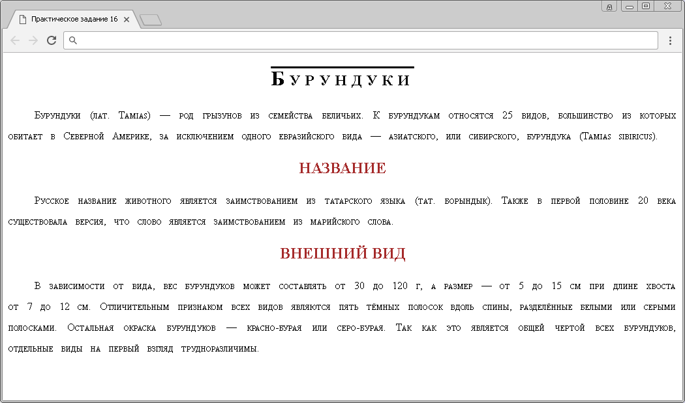
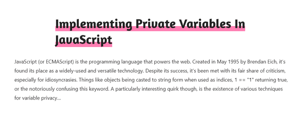
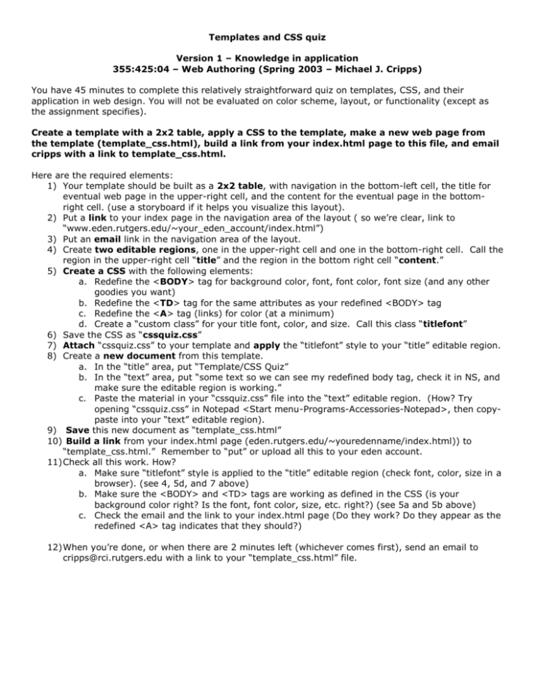
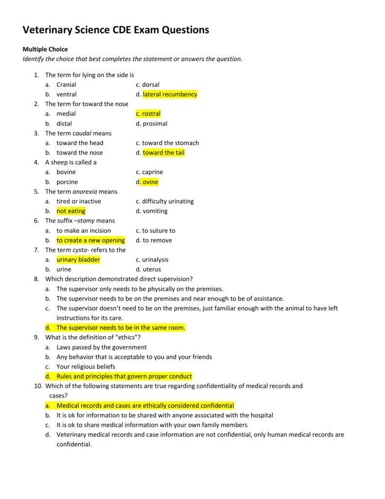

#Теория

- [link](https://developer.mozilla.org/ru/docs/Web/HTML/Element/link#%D1%81%D1%82%D0%B8%D0%BB%D0%B8%D0%B7%D0%B0%D1%86%D0%B8%D1%8F_%D1%81_css)
- [ОсновыредактированиетекставHTML](https://developer.mozilla.org/ru/docs/Learn/HTML/Introduction_to_HTML/HTML_text_fundamentals)
- [span](https://doka.guide/html/span/)
- [address](https://doka.guide/html/address/)
- [blockquote](https://doka.guide/html/blockquote/)
- [q](https://doka.guide/html/q/)
- [sup](https://doka.guide/html/sup/)
- [sub](https://doka.guide/html/sub/)
- [dl, dd, dt](https://doka.guide/html/dl-dd-dt/)
- [color](https://doka.guide/css/color/)
- [font-family](https://doka.guide/css/font-family/)
- [font-size](https://doka.guide/css/font-size/)
- [line-height](https://doka.guide/css/line-height/)
- [text-align](https://doka.guide/css/text-align/)
- [text-transform](https://doka.guide/css/text-transform/)
- [vertical-align](https://doka.guide/css/vertical-align/)
- [@font-face](https://doka.guide/css/font-face/)
- [font-style](https://doka.guide/css/font-style/)
- [font-weight](https://doka.guide/css/font-weight/)
- [font-display](https://doka.guide/css/font-display/)
- [font](https://doka.guide/css/font/)
- [font-smooth](https://doka.guide/css/font-smooth/)
- [letter-spacing](https://doka.guide/css/letter-spacing/)
- [text-decoration](https://doka.guide/css/text-decoration/)
- [text-decoration-color](https://doka.guide/css/text-decoration-color/)
- [text-decoration-line](https://doka.guide/css/text-decoration-line/)
- [text-decoration-style](https://doka.guide/css/text-decoration-style/)
- [text-decoration-thickness](https://doka.guide/css/text-decoration-thickness/)
- [text-decoration-skip-ink](https://doka.guide/css/text-decoration-skip-ink/)
- [text-rendering](https://doka.guide/css/text-rendering/)
- [text-shadow](https://doka.guide/css/text-shadow/)
- [white-space](https://doka.guide/css/white-space/)
- [quotes](https://doka.guide/css/quotes/)
- [overflow-wrap](https://doka.guide/css/overflow-wrap/)
- [hyphens](https://doka.guide/css/hyphens/)
- [text-indent](https://doka.guide/css/text-indent/)
- [text-justify](https://doka.guide/css/text-justify/)
- [text-orientation](https://doka.guide/css/text-orientation/)
- [text-overflow](https://doka.guide/css/text-overflow/)
- [text-size-adjust](https://doka.guide/css/text-size-adjust/)
- [text-underline-offset](https://doka.guide/css/text-underline-offset/)
- [text-underline-position](https://doka.guide/css/text-underline-position/)
- [word-break](https://doka.guide/css/word-break/)
- [word-spacing](https://doka.guide/css/word-spacing/)
- [word-wrap](https://doka.guide/css/word-wrap/)
- [writing-mode](https://doka.guide/css/writing-mode/)
- [tab-size](https://doka.guide/css/tab-size/)

# Практика

## Задача 1

Доделайте форматирование письма с занятия

> Далее во всех заданиях нужно из исходного текста сделать `html` с форматированным текстом 

> Подходящие шрифты можете брать на `Google Fonts`, или из стандартных включенных в `Windows`
## Задача 2

```text
БУРУНДУКИ.
БУРУНДУКИ (ЛАТ. ТАША$) — РОД ГРЫЗУНОВ ИЗ СЕМЕЙСТВА БЕЛИЧЬИХ. К БУРУНДУКАМ ОТНОСЯТСЯ 25 видов, БОЛЬШИНСТВО ИЗ КОТОРЫХ ОБИТАЕТ в СЕВЕРНОЙ АМЕРИКЕ, ЗА ИСКЛЮЧЕНИЕМ ОДНОГО ЕВРАЗИЙСКОГО ВИДА — АЗИАТСКОГО, ИЛИ СИБИРСКОГО, БУРУНДУКА (ГАМГАЗ ЗГВШСИЗ).
Название.
РУССКОЕ НАЗВАНИЕ ЖИВОТНОГО ЯВЛЯЕТСЯ ЗАИМСТВОВАНИЕМ ИЗ ТАТАРСКОГО ЯЗЫКА (ТАТ. БОРЫНДЫК). ТАКЖЕ В ПЕРВОЙ ПОЛОВИНЕ 20 ВЕКА
Существовала версия, что слово является заимствованием из марийского слова.
Внешний вид.
В зависимости от вида, вес бурундуков может составлять от 30 до 120 г, а размер — от 5 до 15 см при длине хвоста от 7 до 12 см. ОТЛИЧИТЕЛЬНЫМ ПРИЗНАКОМ ВСЕХ ВИДОВ ЯВЛЯЮТСЯ ПЯТЬ ТЁМНЫХ ПОЛОСОК ВДОЛЬ СПИНЫ, РАЗДЕЛЁННЫЕ БЕЛЫМИ ИЛИ СЕРЫМИ ПОЛОСКАМИ. ОСТАЛЬНАЯ ОКРАСКА БУРУНДУКОВ — КРАСНО-БУРАЯ ИЛИ СЕРО-БУРАЯ. ТАК КАК ЭТО ЯВЛЯЕТСЯ ОБЩЕЙ ЧЕРТОЙ ВСЕХ БУРУНДУКОВ,
Отдельные виды на первый взгляд трудноразличимы.
```


### Задача 3

```text
implementing private variables in javaScript
JavaScript (or ECMAScript) is the programming language that powers the web. Created in May 1995 by Brendan Eich. it's found its place as a widely-used and versatile technology. Despite its success, it’s been met with its fair share of criticism, especially for idiosyncrasies. Things like objects being casted to string form when used as indices. 1 == “1* returning true, or the notoriously confusing this keyword. A particularly interesting quirk though, is the existence of various techniques for variable privacy...

```


### Задача 4

```text
Templates and CSS quizVersion 1 –Knowledge in application355:425:04 –Web Authoring (Spring 2003 –Michael J. Cripps)You have 45 minutes to complete this relatively straightforward quiz on templates, CSS, and their application in web design. You willnot be evaluated on color scheme, layout, or functionality (except as the assignment specifies).Create a template with a 2x2 table, apply a CSS to the template, make a new web page from the template (template_css.html), build a link from your index.htmlpage to this file, and email cripps with a link to template_css.html.Here are the required elements:1)Your template should be built as a 2x2 table, with navigation in the bottom-left cell, the title for eventual web page in the upper-right cell, and the content for the eventual page in the bottom-right cell. (use a storyboard if it helps you visualize this layout). 2)Put a link to your index page in the navigation area of the layout ( so we’re clear, link to “www.eden.rutgers.edu/~your_eden_account/index.html”)3)Put an emaillink in the navigation area of the layout.4)Create two editable regions, one in the upper-right cell and one in the bottom-right cell.  Call the region in the upper-right cell “title” and the region in the bottom right cell “content.” 5)Create a CSSwith the following elements:a.Redefine the <BODY> tag for background color, font, font color, font size (and any other goodies you want)b.Redefine the <TD> tag for the same attributes as your redefined <BODY> tagc.Redefine the <A> tag (links) for color (at a minimum)d.Create a “custom class” for your title font, color, and size.  Call this class “titlefont”6)Save the CSS as “cssquiz.css”7)Attach“cssquiz.css” to your template and applythe “titlefont” style to your “title” editable region.8)Create a newdocumentfrom this template.a.In the “title” area, put “Template/CSS Quiz”b.In the “text” area, put “some text so we can see my redefined body tag, check it in NS, and make sure the editable region is working.” c.Paste the material in your “cssquiz.css” fileinto the “text” editable region.  (How? Try opening “cssquiz.css” in Notepad <Start menu-Programs-Accessories-Notepad>, then copy-paste into your “text” editable region).9)Savethis new document as “template_css.html”10)Build a linkfrom your index.html page (eden.rutgers.edu/~youredenname/index.html)) to “template_css.html.”  Remember to “put” or upload all this to your eden account.11)Check all this work. How?a.Make sure “titlefont” style is applied to the “title” editable region (check font, color, size in a browser). (see 4, 5d, and 7 above)b.Make sure the <BODY> and <TD> tags are working as defined in the CSS (is your background color right? Is the font, font color, size, etc. right?) (see 5a and 5b above)c.Check the email and the link to your index.html page (Do they work? Do they appear as the redefined <A> tag indicates that they should?)12)When you’re done, or when there are 2 minutes left (whichever comes first), send an email to cripps@rci.rutgers.edu with a link to your “template_css.html” file. 
```



### Задача 5

> Варианты ответа располагать в 1 колноку (столбец)

```text
Veterinary Science CDE Exam QuestionsMultiple ChoiceIdentify the choice that best completes the statement or answers the question.1.The term for lying on the side isa.Cranialc. dorsalb.ventrald. lateralrecumbency2.The term for toward the nosea.medialc. rostralb.distald. prosimal3.The term caudalmeansa.toward the headc. toward the stomachb.toward the nosed. toward the tail4.A sheep is called a a.bovinec. caprineb.porcined. ovine5.The term anorexiameansa.tired or inactivec. difficulty urinatingb.not eatingd. vomiting6.The suffix –stomymeansa.to make an incisionc. to suture tob.to create a new openingd. to remove7.The term cysto-refers to the a.urinary bladderc. urinalysisb.urined. uterus8.Which description demonstrated direct supervision?a.The supervisor only needs to be physically on the premises.b.The supervisor needs to be on the premises and near enough to be of assistance.c.The supervisor doesn’t need to be on the premises, just familiar enough with the animal to have left instructions for its care.d.The supervisor needs to be in the same room.9.What is the definition of “ethics”?a.Laws passed by the governmentb.Any behavior that is acceptable to you and your friendsc.Your religious beliefsd.Rules and principles that govern proper conduct10.Which of the following statements are true regarding confidentiality of medical records and       cases?a.Medical records and cases are ethically considered confidential b.It is ok for information to be shared with anyone associated withthe hospitalc.It is ok to share medical information with your own family membersd.Veterinary medical records and case information are not confidential, only human medical records are confidential.

```

