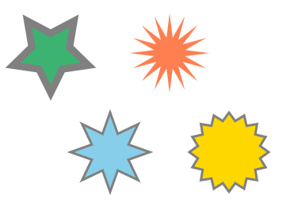

# Теория

- [Класс: базовый синтаксис](https://learn.javascript.ru/class)
- [Наследование классов](https://learn.javascript.ru/class-inheritance)
- [Статические свойства и методы](https://learn.javascript.ru/static-properties-methods)
- [Приватные и защищённые методы и свойства](https://learn.javascript.ru/private-protected-properties-methods)
- [Расширение встроенных классов](https://learn.javascript.ru/extend-natives)
- [Проверка класса: "instanceof"](https://learn.javascript.ru/instanceof)
- [Классы](https://developer.mozilla.org/ru/docs/Web/JavaScript/Reference/Classes)

- [Руководство по Canvas](https://developer.mozilla.org/ru/docs/Web/API/Canvas_API/Tutorial)
- [2D игра на чистом JavaScript](https://developer.mozilla.org/ru/docs/Games/Tutorials/2D_Breakout_game_pure_JavaScript)
- [2D игра на Phaser](https://developer.mozilla.org/ru/docs/Games/Tutorials/2D_breakout_game_Phaser)

# Задача 1

Реализуйте функции конструктор для `Student` и `Aspirant`, аспирант отличается от студента наличием некой научной работы.

`Student` содержит свойства:
- `firstName`
- `lastName`
- `group`
- `averageMark` (содержащую среднюю оценку).

`Aspirant` имеет дополнительное свойство `work`

Создать метод `getScholarship()` для  `Student`, который возвращает сумму стипендии. Если средняя оценка студента больше или равна `5`, то сумма `100`, иначе `80`.

Переопределить этот метод в  `Aspirant`.  Если средняя оценка аспиранта равна `5`, то сумма `200`, иначе `180`.

Создать несколько объектов типа `Student` и `Aspirant`. Создать массив  содержащий объекты  `Student` и `Aspirant`. Вызвать метод `getScholarship()` для каждого элемента массива. 

# Задача 2

Нарисуйте при помощи canvas

