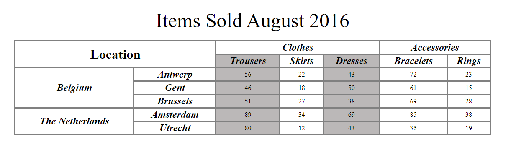
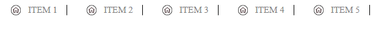

# Теория

- [HTML таблицы основы](https://developer.mozilla.org/ru/docs/Learn/HTML/Tables/Basics)
- [HTML таблицы продвинутые](https://developer.mozilla.org/ru/docs/Learn/HTML/Tables/Advanced)
- [Таблицы](https://doka.guide/html/tables/)
- [background-color](https://doka.guide/css/background-color/)
- [background-image](https://doka.guide/css/background-image/)
- [background-position](https://doka.guide/css/background-position/)
- [background-repeat](https://doka.guide/css/background-repeat/)
- [background-size](https://doka.guide/css/background-size/)
- [background-attachment](https://doka.guide/css/background-attachment/)
- [background-clip](https://doka.guide/css/background-clip/)
- [background-origin](https://doka.guide/css/background-origin/)
- [flow](https://doka.guide/html/flow/)
- [normal flow](https://developer.mozilla.org/ru/docs/Learn/CSS/CSS_layout/Normal_Flow)
- [display](https://doka.guide/css/display/)
- [border](https://doka.guide/css/border/)


# Практика

## Задача 1



Постарайтесь сделать самостоятельно, если не поличится можете посмотреть решение [html](https://github.com/msheiko/msheiko.github.io/blob/main/js/slides/img/table/index.html) и [css](https://github.com/msheiko/msheiko.github.io/blob/main/js/slides/img/table/main.css)

---

## Задача 2


---

## Задача 3


---

## Задача 4


## Задача 5


## Задача 6

Дан `html` 
```html
<ul>
    <li><a href="#">Item 1</a></li>
    <li><a href="#">Item 2</a></li>
    <li><a href="#">Item 3</a></li>
    <li><a href="#">Item 4</a></li>
    <li><a href="#">Item 5</a></li>
</ul>
```
Не меняя в нем НИЧЕГО, получить



[Cсылка на картинку](https://cdn4.iconfinder.com/data/icons/user-interface-33/80/Home-512.png)