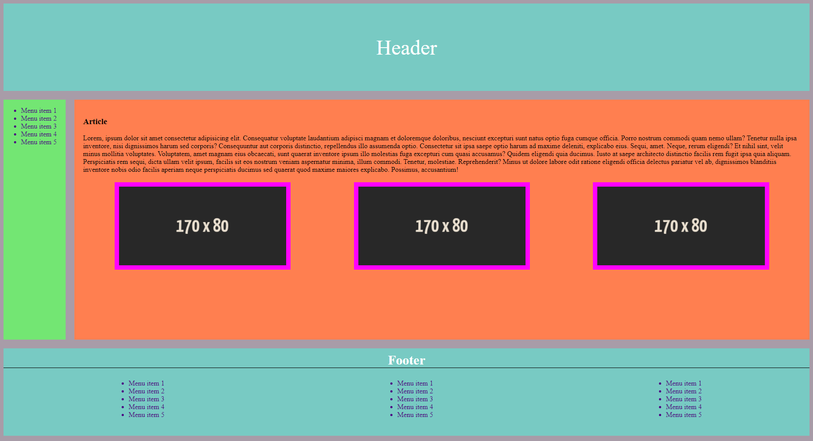

# Теория

- [Псевдоклассы](https://doka.guide/css/pseudoclasses/)
- [:link](https://doka.guide/css/link/)
- [:visited](https://doka.guide/css/visited/)
- [:hover](https://doka.guide/css/hover/)
- [:active](https://doka.guide/css/active/)
- [Псевдоклассы группы child](https://doka.guide/css/child/)
- [Гайд по flexbox](https://doka.guide/css/flexbox-guide/)
- [flex](https://doka.guide/css/flex/)
- [flex-basis](https://doka.guide/css/flex-basis/)
- [flex-direction](https://doka.guide/css/flex-direction/)
- [flex-flow](https://doka.guide/css/flex-flow/)
- [flex-grow](https://doka.guide/css/flex-grow/)
- [flex-shrink](https://doka.guide/css/flex-shrink/)
- [flex-wrap](https://doka.guide/css/flex-wrap/)
- [order](https://doka.guide/css/order/)
- [justify-content](https://doka.guide/css/justify-content/)
- [align-content](https://doka.guide/css/align-content/)
- [align-items](https://doka.guide/css/align-items/)
- [align-self](https://doka.guide/css/align-self/)
- [MDN FlexBox](https://developer.mozilla.org/ru/docs/Learn/CSS/CSS_layout/Flexbox)


# Практика
Дан html

```html
<!DOCTYPE html>
<html lang="en">
  <head>
    <title>Document</title>
  </head>
  <body>
      <header>Header</header>
      <main>
        <aside>
          <nav>
            <ul>
              <li>Menu item 1</li>
              <li>Menu item 2</li>
              <li>Menu item 3</li>
              <li>Menu item 4</li>
              <li>Menu item 5</li>
            </ul>
          </nav>
        </aside>
        <article>
          <h3>Article</h3>
          <p>
            Lorem, ipsum dolor sit amet consectetur adipisicing elit.
            Consequatur voluptate laudantium adipisci magnam et doloremque
            doloribus, nesciunt excepturi sunt natus optio fuga cumque officia.
            Porro nostrum commodi quam nemo ullam? Tenetur nulla ipsa inventore,
            nisi dignissimos harum sed corporis? Consequuntur aut corporis
            distinctio, repellendus illo assumenda optio. Consectetur sit ipsa
            saepe optio harum ad maxime deleniti, explicabo eius. Sequi, amet.
            Neque, rerum eligendi? Et nihil sint, velit minus mollitia
            voluptates. Voluptatem, amet magnam eius obcaecati, sunt quaerat
            inventore ipsum illo molestias fuga excepturi cum quasi accusamus?
            Quidem eligendi quia ducimus. Iusto at saepe architecto distinctio
            facilis rem fugit ipsa quia aliquam. Perspiciatis rem sequi, dicta
            ullam velit ipsum, facilis sit eos nostrum veniam aspernatur minima,
            illum commodi. Tenetur, molestiae. Reprehenderit? Minus ut dolore
            labore odit ratione eligendi officia delectus pariatur vel ab,
            dignissimos blanditiis inventore nobis odio facilis aperiam neque
            perspiciatis ducimus sed quaerat quod maxime maiores explicabo.
            Possimus, accusantium!
          </p>
          <footer>
            
            
            
          </footer>
        </article>
      </main>
      <footer>
        <h4>Footer</h4>
        <nav>
          <ul>
            <li>Menu item 1</li>
            <li>Menu item 2</li>
            <li>Menu item 3</li>
            <li>Menu item 4</li>
            <li>Menu item 5</li>
          </ul>
          <ul>
            <li>Menu item 1</li>
            <li>Menu item 2</li>
            <li>Menu item 3</li>
            <li>Menu item 4</li>
            <li>Menu item 5</li>
          </ul>
          <ul>
            <li>Menu item 1</li>
            <li>Menu item 2</li>
            <li>Menu item 3</li>
            <li>Menu item 4</li>
            <li>Menu item 5</li>
          </ul>
        </nav>
      </footer>
  </body>
</html>

```

Ничего не меняя в `html` (можно только подключить стили `css`) получить шаблон как на картинке
