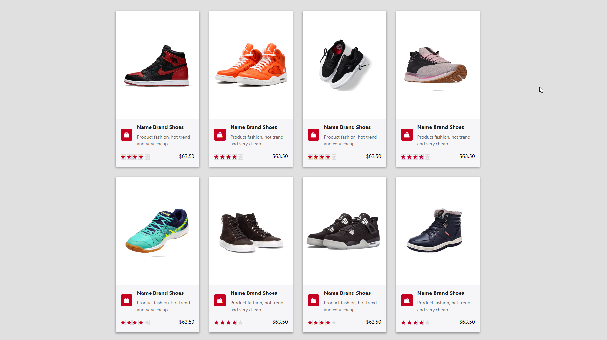
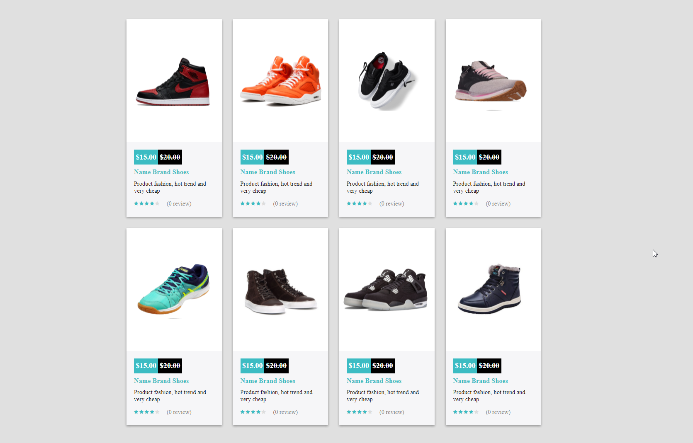
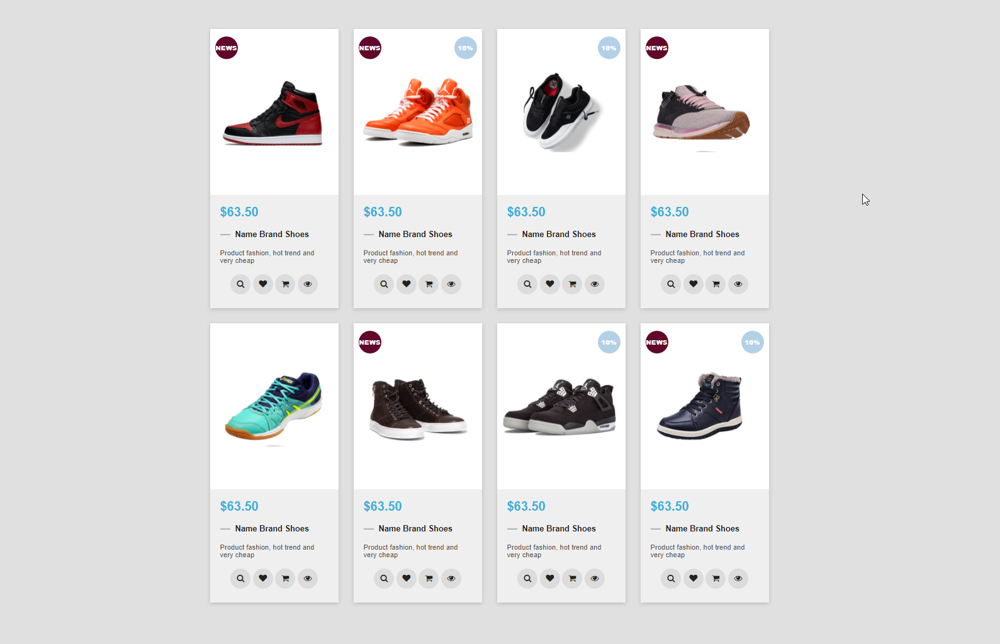
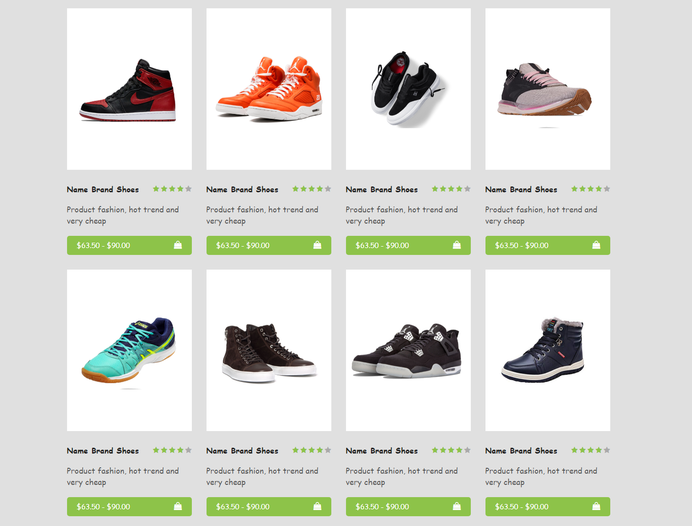
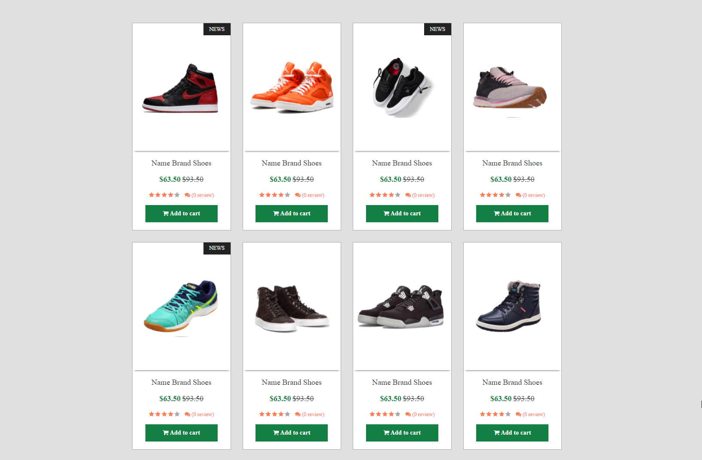

# Теория

- [overflow](https://doka.guide/css/overflow/)
- [box-shadow](https://doka.guide/css/box-shadow/)

# Практика

Нужно сверстать все 5 шаблонов каталога товаров

> Шрифты найдите похожие на google fonts

Картинки продуктов:

- [1](./img/shoes/1.png)
- [2](./img/shoes/2.png)
- [3](./img/shoes/3.png)
- [4](./img/shoes/4.png)
- [5](./img/shoes/5.png)
- [6](./img/shoes/6.png)
- [7](./img/shoes/7.png)
- [8](./img/shoes/8.png)

Шаблоны

# 1

# 2

# 3

# 4

# 5

