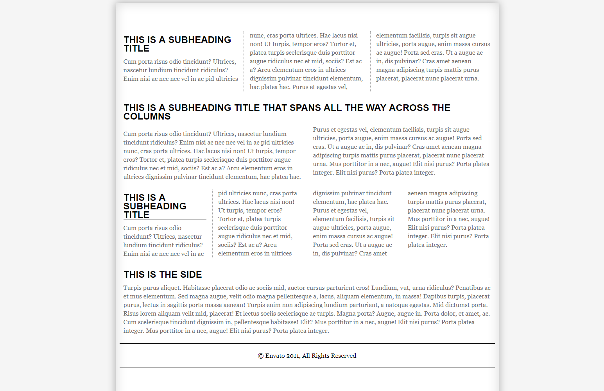
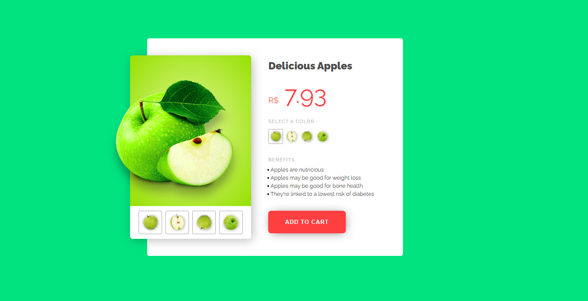

# Теория

- [Универсальные селекторы](https://developer.mozilla.org/ru/docs/Web/CSS/Universal_selectors)
- [Селектор дочерних элементов](https://developer.mozilla.org/ru/docs/Web/CSS/Child_combinator)
- [Селектор следующего элемента](https://developer.mozilla.org/ru/docs/Web/CSS/General_sibling_combinator)
- [Смежные селекторы](https://developer.mozilla.org/ru/docs/Web/CSS/Adjacent_sibling_combinator)
- [Float](https://developer.mozilla.org/ru/docs/Learn/CSS/CSS_layout/Floats)
- [Позиционирование](https://developer.mozilla.org/ru/docs/Learn/CSS/CSS_layout/Positioning)
- [Макет с несколькими столбцами](https://developer.mozilla.org/ru/docs/Learn/CSS/CSS_layout/Multiple-column_Layout)

# Практика

Сверстать html по картинке

```html
<!DOCTYPE html>
<html lang="en">
  <head>
    <meta charset="UTF-8" />
    <meta http-equiv="X-UA-Compatible" content="IE=edge" />
    <meta name="viewport" content="width=device-width, initial-scale=1.0" />
    <title>Document</title>
  </head>
  <body>
    <body>
      <div class="wrapper">
        <div class="main">
          <h2>This is a subheading Title</h2>
          <p>
            Cum porta risus odio tincidunt? Ultrices, nascetur lundium tincidunt
            ridiculus? Enim nisi ac nec nec vel in ac pid ultricies nunc, cras
            porta ultrices. Hac lacus nisi non! Ut turpis, tempor eros? Tortor
            et, platea turpis scelerisque duis porttitor augue ridiculus nec et
            mid, sociis? Est ac a? Arcu elementum eros in ultrices dignissim
            pulvinar tincidunt elementum, hac platea hac. Purus et egestas vel,
            elementum facilisis, turpis sit augue ultricies, porta augue, enim
            massa cursus ac augue! Porta sed cras. Ut a augue ac in, dis
            pulvinar? Cras amet aenean magna adipiscing turpis mattis purus
            placerat, placerat nunc placerat urna.
          </p>
        </div>
        <!-- / main-->

        <div class="main2">
          <h2>
            This is a subheading Title that Spans all the Way Across The Columns
          </h2>
          <p>
            Cum porta risus odio tincidunt? Ultrices, nascetur lundium tincidunt
            ridiculus? Enim nisi ac nec nec vel in ac pid ultricies nunc, cras
            porta ultrices. Hac lacus nisi non! Ut turpis, tempor eros? Tortor
            et, platea turpis scelerisque duis porttitor augue ridiculus nec et
            mid, sociis? Est ac a? Arcu elementum eros in ultrices dignissim
            pulvinar tincidunt elementum, hac platea hac. Purus et egestas vel,
            elementum facilisis, turpis sit augue ultricies, porta augue, enim
            massa cursus ac augue! Porta sed cras. Ut a augue ac in, dis
            pulvinar? Cras amet aenean magna adipiscing turpis mattis purus
            placerat, placerat nunc placerat urna. Mus porttitor in a nec,
            augue! Elit nisi purus? Porta platea integer. Elit nisi purus? Porta
            platea integer.
          </p>
        </div>
        <!-- / main2-->

        <div class="main3">
          <h2>This is a subheading Title</h2>
          <p>
            Cum porta risus odio tincidunt? Ultrices, nascetur lundium tincidunt
            ridiculus? Enim nisi ac nec nec vel in ac pid ultricies nunc, cras
            porta ultrices. Hac lacus nisi non! Ut turpis, tempor eros? Tortor
            et, platea turpis scelerisque duis porttitor augue ridiculus nec et
            mid, sociis? Est ac a? Arcu elementum eros in ultrices dignissim
            pulvinar tincidunt elementum, hac platea hac. Purus et egestas vel,
            elementum facilisis, turpis sit augue ultricies, porta augue, enim
            massa cursus ac augue! Porta sed cras. Ut a augue ac in, dis
            pulvinar? Cras amet aenean magna adipiscing turpis mattis purus
            placerat, placerat nunc placerat urna. Mus porttitor in a nec,
            augue! Elit nisi purus? Porta platea integer. Elit nisi purus? Porta
            platea integer.
          </p>
        </div>
        <!-- / main3-->

        <div class="side">
          <h2>This is the side</h2>
          <p>
            Turpis purus aliquet. Habitasse placerat odio ac sociis mid, auctor
            cursus parturient eros! Lundium, vut, urna ridiculus? Penatibus ac
            et mus elementum. Sed magna augue, velit odio magna pellentesque a,
            lacus, aliquam elementum, in massa! Dapibus turpis, placerat purus,
            lectus in sagittis porta massa aenean! Turpis enim non adipiscing
            lundium parturient, a natoque egestas. Mid dictumst porta. Risus
            lorem aliquam velit mid, placerat! Et lectus sociis scelerisque ac
            turpis. Magna porta? Augue, augue in. Porta dolor, et amet, ac. Cum
            scelerisque tincidunt dignissim in, pellentesque habitasse! Elit?
            Mus porttitor in a nec, augue! Elit nisi purus? Porta platea
            integer. Mus porttitor in a nec, augue! Elit nisi purus? Porta
            platea integer.
          </p>
        </div>
        <!-- / side -->

        <div class="footer">
          <p>© <a href="" title="">Envato</a> 2011, All Rights Reserved</p>
        </div>
        <!-- / footer -->
      </div>
      <!-- / Wrapper -->
    </body>
  </body>
</html>

```



# Задача 2

Ресурсы картинок

- [1](./img/position/apple-top.png)
- [2](./img/position/green-apple-flipped.png)
- [3](./img/position/green-apple-with-slice.png)
- [4](./img/position/green-apple2.png)
- [5](./img/position/half-apple.png)

Сверстать


