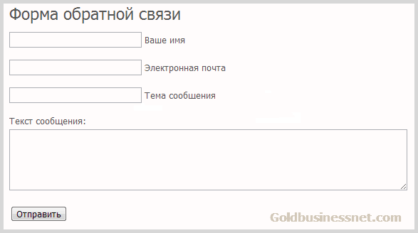
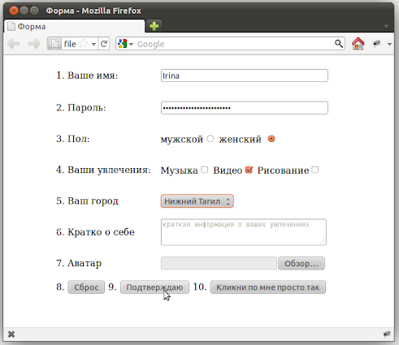
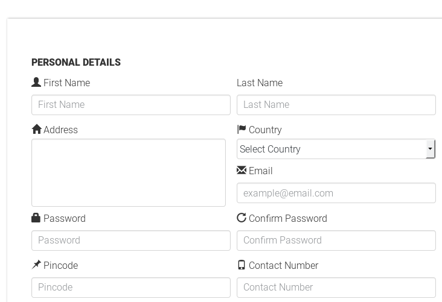
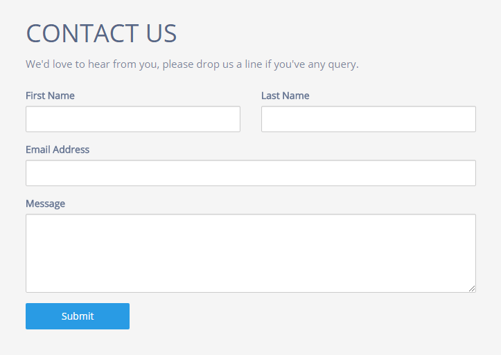
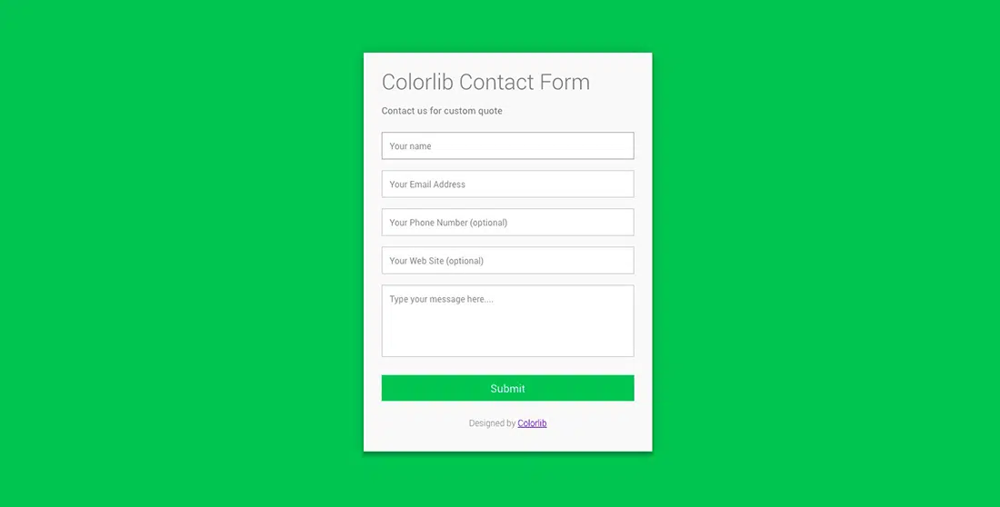

# Теория

- [Ваша первая HTML форма](https://developer.mozilla.org/ru/docs/Learn/Forms/Your_first_form)
- [Как структурировать HTML-формы](https://developer.mozilla.org/ru/docs/Learn/Forms/How_to_structure_a_web_form)
- [Стандартные виджеты форм](https://developer.mozilla.org/ru/docs/Learn/Forms/Basic_native_form_controls)
- [form](https://doka.guide/html/form/)
- [input](https://doka.guide/html/input/)
- [textarea](https://doka.guide/html/textarea/)
- [button](https://doka.guide/html/button/)
- [select](https://doka.guide/html/select/)
- [option](https://doka.guide/html/option/)
- [optgroup](https://doka.guide/html/optgroup/)
- [datalist](https://doka.guide/html/datalist/)
- [label](https://doka.guide/html/label/)
- [fieldset](https://doka.guide/html/fieldset/)
- [legend](https://doka.guide/html/legend/)
- [placeholder](https://doka.guide/html/placeholder/)
- [Селектор по атрибуту](https://doka.guide/css/attribute-selector/)
- [Псевдоэлементы](https://doka.guide/css/pseudoelements/)
- [::before](https://doka.guide/css/before/)
- [::after](https://doka.guide/css/after/)
- [content](https://doka.guide/css/content/)
- [CSS счётчики](https://developer.mozilla.org/ru/docs/Web/CSS/CSS_Counter_Styles/Using_CSS_counters)
- [Развлечения с CSS-счётчиками](https://css-live.ru/articles/razvlecheniya-s-css-schyotchikami.html)
- [counter-set](https://doka.guide/css/counter-set/)
- [counter-reset](https://doka.guide/css/counter-reset/)
- [counter-increment](https://doka.guide/css/counter-increment/)
- [opacity](https://doka.guide/css/opacity/)
- [visibility](https://doka.guide/css/visibility/)

# Практика

> Во всех заданиях нужно сверстать форуму по шаблону из картинки

# Задание 1

# Задание 2

# Задание 3

# Задание 4

# Задание 5

# Задание 6
