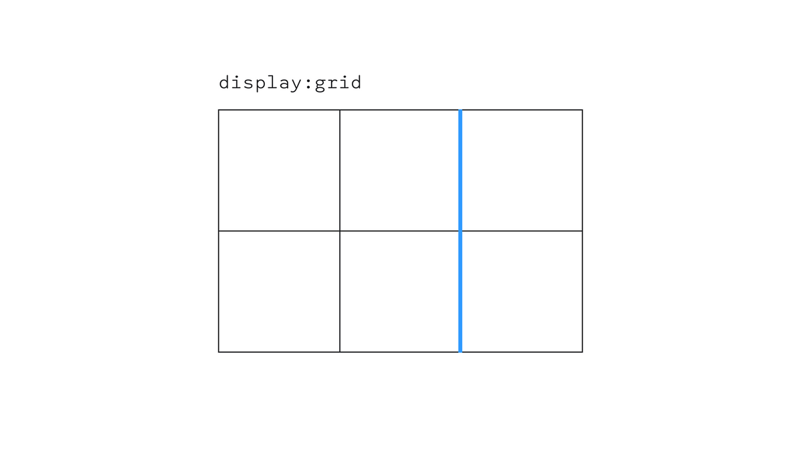
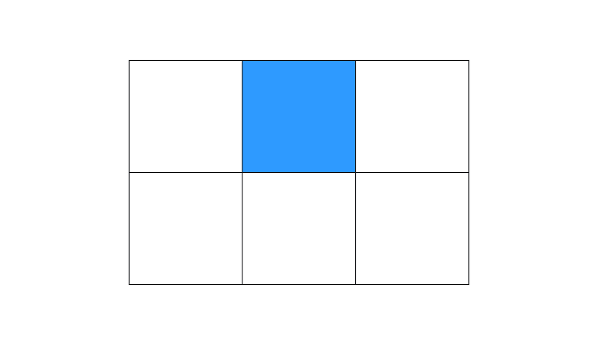
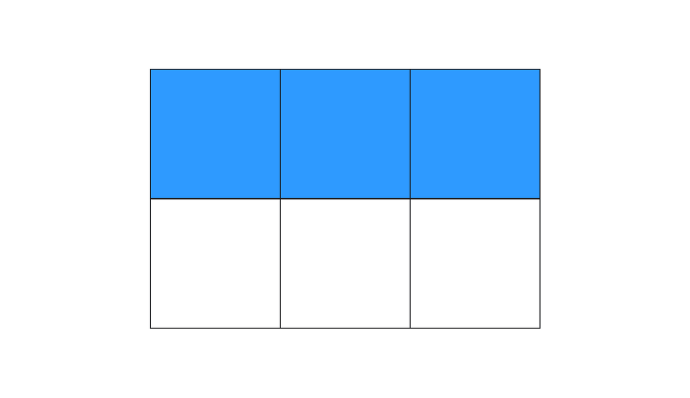
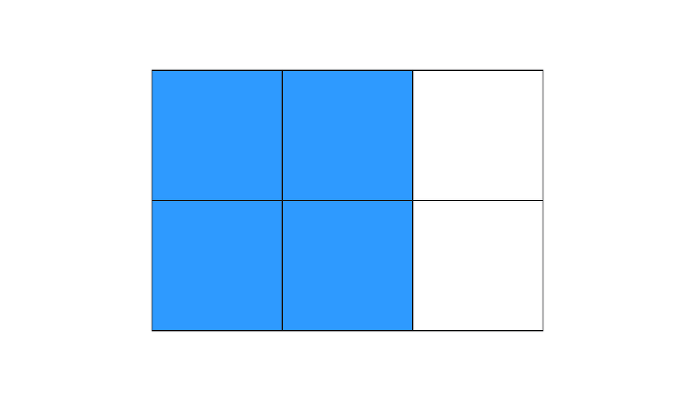

# Повторить git

- `обновить гит`
- `git init`
- `git add .`
- `git commit -m "commit comment"`
- `git push`

Сохранение учутных данных в кеше

```bash
git config --global credential.helper 'cache --timeout=300'
```

# attr()

`attr()` — это CSS-функция, которая умеет получать значение любого атрибута элемента, а потом использовать это значение прямо в стилях.

```css
div::before {
  content: "Элемент с классом " attr(class);
}

div::after {
  content: "Подсказка: " attr(title);
}

```

> Функцию `attr()` можно использовать в качестве значения любого CSS-свойства, однако полностью поддерживается только свойство `content`. Для остальных свойств поддержка экспериментальная

---

# calc()

`calc()` - это функция CSS, которая даёт возможность рассчитать значения свойств CSS во время их определения.

В круглых скобках мы можем писать любые математические операции с любыми единицами измерения, доступными в вебе `(%, px, rem, em, vw, vh, vmin и т.д.)`. Доступны четыре стандартных операнда:

- `+` — сложение
- `—` вычитание
- `/` — деление
- `*` — умножение

```css
.selector {
  width: calc(100% - 2rem);
}
.selector {
  margin: calc(5vh / 4) 20px;
  transition: transform calc(0.5s + 120ms);
}

```

---

# blur()

`blur()` Примеряет размытие Гаусса к изображению. Значение в скобках указывает сколько пикселей сливаются друг с другом. Чем больше значение, тем больше размытие. Можно указать положительное значение в любых единицах измерения, кроме процентов.

```css
img {
  filter: blur(3px);
}

```

---

# brightness()

`brightness()` Меняет яркость изображения. В скобках можно указать любое значение от 0% и выше. Значение 0% сделает изображение полностью чёрным. Значение 100% вернёт изображению исходную яркость. Значение больше 100% выкрутит яркость картинки. Значением может быть целое или дробное число без единиц измерения.

```css
img {
  filter: brightness(30%);
}
```
 
---

# contrast()

`contrast()` Меняет контраст изображения. В скобках можно указать любое значение от 0% и выше. Значение 0% сделает изображение полностью чёрным. Значение 100% вернёт изображению исходный контраст. Значение больше 100% усилит исходный контраст. Значением может быть целое или дробное число без единиц измерения.

```css
img {
  filter: contrast(250%);
}
```
---

# drop-shadow()

`drop-shadow()` Задаёт тень для картинки. Тень располагается снаружи элемента. Эта функция очень похожа на `box-shadow` по допустимым значениям и результату. Разница лишь в том, что нельзя указывать ключевое слово `inset`.

```css
img {
  filter: drop-shadow(4px 4px red);
}
```

---

# grayscale()

`grayscale()`  Делает изображение чёрно-белым. В скобках можно указать значение от 0% до 100%. Значение 100% сделает изображение полностью чёрно-белым. Значение 0% вернёт изображению исходные цвета. Значением может быть целое или дробное число без единиц измерения.

```css
img {
  filter: grayscale(80%);
}

```

---

# hue-rotate()

`hue-rotate()` Меняет цвета изображения за счёт поворота цветового круга. Угол поворота указывается в скобках функции. Можно указывать угол в градусах `deg` или в поворотах `turn`.

```css
img {
  filter: hue-rotate(0.5turn);
}
```
---

# invert()

`invert()` Инвертирует цвета изображения, как бы выворачивает их, превращая в противоположные. В результате получается что-то вроде негатива. Можно указать процент инверсии от 0% до 100%. При 100% цвета на картинке полностью инвертированы. Отрицательные значения или значения больше 100% не допускаются.

```css
img {
  filter: invert(100%);
}
```

---

# opacity()

`opacity()` Меняет прозрачность изображения. Можно указать процент прозрачности от 0% до 100%. 0% делает картинку полностью прозрачной. 100% не меняет прозрачность изображения. Отрицательные значения или значения больше 100% не допускаются.

> Очень похоже на работу свойства `opacity` с той разницей, что для фильтра браузер, как правило, применяет аппаратное ускорение для улучшения производительности.

```css
img {
  filter: opacity(40%);
}
```

---

# saturate()

`saturate()` Меняет насыщенность цветов изображения. Значение 0% полностью убирает насыщенность цветов. Значение 100% не изменяет исходное изображение. Допускаются значения больше 100% что приводит к перенасыщенности. Нельзя указать отрицательное значение.

```css
img {
  filter: saturate(390%);
}
```

---

# sepia()

`sepia()` Меняет цвета изображения на сепию — коричневые оттенки. Значение 100% полностью преобразует изображение в сепию. Значение 0% не изменяет исходное изображение. Отрицательные значения или значения больше 100% не допускаются. Можно использовать целое или дробное число без единиц измерения в качестве значения.

```css
img {
  filter: sepia(0.6);
}
```

---

# var() / кастомные свойства

Кастомное свойство — это произвольное свойство с определённым значением. Оно отличается от стандартного CSS-свойства способом записи. Чтобы применить кастомное свойство, нужно передать его в CSS-функцию `var()`

CSS-функция `var()` позволяет подставлять кастомные свойства в качестве значения свойств.

> Кастомных свойств не существует в спецификации CSS. По способам применения они больше всего похожи на переменные в языках программирования. Если мы определили кастомное свойство, то в дальнейшем можно его переиспользовать сколько угодно раз.

```css
:root {
  --text-color: #18191C;
}

.header-primary {
  font-size: 2em;
  color: var(--text-color);
  margin-bottom: .5em;
}
```

Функция `var()` принимает 2 аргумента:

- Имя кастомного свойства.
- Резервное значение (необязательный).
> Если кастомное свойство, на которое ссылается первый аргумент, недопустимо, функция использует второе значение

```css
.card {
  padding: var(--card-padding, 10px);
}
.element-3 {
  --red: 0;
  --green: 0;
  --blue: 0;
  color: rgb(var(--red), var(--green), var(--blue));
}
```

---

# :root

Псевдокласс `:root` нужен для обращения к самому главному родительскому элементу документа. Его также называют корневым элементом. В случае HTML-документа самым главным родителем всей страницы будет тег `<html>`. Часто `:root` используется для того, чтобы задавать кастомные свойства.

```css
:root {
  font-family: 'Oswald', sans-serif;
  --button-size: 40px;
  --main-color: #bada55;
}
```

> Поскольку `:root` — это псевдокласс, его специфичность будет выше, чем селекторов по тегу html

```css
:root {
  background-color: peachpuff;
}

html {
  background-color: tomato;
}

```

----

# CSS Grid Layout

CSS Grid Layout (спецификация) или просто гриды — это удобная технология для раскладки элементов на веб-страницах. В отличие от флексбоксов, одновременно работающих только с одним измерением, гриды дают возможность работать одновременно с двумя: горизонталью и вертикалью.

---

# Основные термины

- `Грид-контейнер`: родительский элемент, к которому применяется свойство display: grid.

- `Грид-элемент`: дочерний элемент, прямой потомок грид-контейнера. Подчиняется правилам раскладки гридов.

- `Грид-линия`: разделительная линия, формирующая структуру грида. Может быть как вертикальной (грид-линия колонки), так и горизонтальной (грид-линия ряда). Располагается по обе стороны от колонки или ряда. Используется для привязки грид-элементов.



- `Грид-ячейка`: пространство между соседними грид-линиями. Единица грид-сетки.



- `Грид-полоса`: пространство между двумя соседними грид-линиями. Может быть проще думать о грид-полосе как о ряде или колонке.



- `Грид-область`: область, ограниченная четырьмя грид-линиями. Может состоять из любого количества ячеек как по горизонтали, так и по вертикали.



---

### display 

```css
.container {
  display: grid;
}
.container {
  display: inline-grid;
}

```

Если элементу задано свойство `display` со значением `grid`, то такой элемент становится грид-контейнером. Дочерние элементы этого контейнера начинают подчиняться правилам грид-раскладки. Снаружи грид-контейнер ведёт себя как блок (строчный элемент).

---

#  grid-template-columns

`grid-template-columns` Свойство, задающее размеры и количество колонок грид-раскладки.

```css
.container {
  display: grid;
  grid-template-columns: 40px auto 40%;
}

```

> В качестве значения указывается то количество размеров, какое количество колонок необходимо. Размеры могут указываться в любых доступных единицах измерения. Размеры перечисляются через пробел

> Можно использовать функцию `repeat()` для создания колонок одного размера.

> Удобно использовать единицу измерения `fr`, чтобы указать, в каких соотношениях колонки разделят свободное место.

> Кроме непосредственного количества колонок и их размеров можно задавать и имена для грид-линий, ограничивающих эти колонки:

```css
.container {
  display: grid;
  grid-template-columns: [start] 140px [line2] 250px [line3] 40px [end];
}
```

---

# grid-template-rows

`grid-template-rows` Свойство, задающее размеры и количество рядов грид-раскладки.

```css
.container {
  display: grid;
  grid-template-rows: 250px 5vw 15rem;
}

```

> Работает также как и ` grid-template-columns` и поддерживает те же возможности

---

# grid-auto-columns, grid-auto-rows

Если элементов внутри грид-контейнера больше, чем может поместиться в заданные явно ряды и колонки, то для них создаются автоматические, неявные ряды и колонки. При помощи свойств `grid-auto-columns` и `grid-auto-rows` можно управлять размерами этих автоматических рядов и колонок.

> В качестве значения можно указать одно или более значений размеров создаваемых неявных грид-полос. При указании более одного значения размеры разделяются пробелами.

> Если указано несколько значений, то паттерн будет повторяться, пока все элементы не поместятся в раскладку.

```css
.container {
  display: grid;
  grid-template-rows: 50px 150px;
  grid-auto-rows: 15px;
  gap: 10px;
}

.item {
  background: lightblue;
}

.item:nth-child(n + 3) {
  background: pink;
}

```

---


# grid-auto-flow

Если грид-элементов больше, чем явно объявленных колонок или рядов, то они автоматически размещаются внутри родителя. А вот каким образом — в ряд или в колонку — можно указать при помощи свойства `grid-auto-flow`.

- `row` (значение по умолчанию) — автоматически размещаемые элементы выстраиваются в ряды.
- `column` — автоматически размещаемые элементы выстраиваются в колонки.
- `dense` — браузер старается заполнить дырки (пустые ячейки) в разметке, если размеры элементов позволяют. Можно сочетать с остальными значениями.

```css
.container {
  grid-template-columns: auto auto auto;
  /* Автоматическое размещение в ряд */
  grid-auto-flow: row dense;
}

```
---

# grid-template-areas

Позволяет задать шаблон сетки расположения элементов внутри грид-контейнера. Имена областей задаются при помощи свойства `grid-area`. Текущее свойство `grid-template-areas` просто указывает, где должны располагаться эти грид-области.

- `none` (значение по умолчанию) — области сетки не задано имя.
- `.` — означает пустую ячейку.
- `name` — собственно название области, может быть абсолютно любым словом или даже эмодзи! 🤯

> Обратите внимание, что нужно называть каждую из ячеек. Например, если шапка или подвал нашего сайта будут занимать все три существующие колонки, то нужно будет написать трижды названия этих областей. Удобнее всего будет подписывать области в виде некой таблицы

```css
.container {
  display: grid;
  grid-template-columns: 1fr 200px 1fr;
  grid-template-rows: repeat(4, 150px);
  grid-template-areas:
    "header header header"
    "content content 👾"
    "content content ."
    "footer footer footer";
}
.item1 {
  grid-area: header;
  background-color: purple;
}
```

---

# column-gap, row-gap

Задаёт отступы между колонками и рядами в грид-раскладке.

> Указывайте одно значение размера в любых единицах измерения.

```css
.container {
  display: grid;
  grid-template-columns: 1fr 200px 1fr;
  grid-template-rows: repeat(3, 150px);
  /* Отступы между колонками */
  column-gap: 10px;
  /* Отступы между рядами */
  row-gap: 50px;
}

```

---

# gap

Шорткат для записи значений свойств `row-gap` и `column-gap`. Значения разделяются пробелом:

```css
.container {
  display: grid;
  grid-template-columns: 1fr 200px 1fr;
  grid-template-rows: repeat(3, 150px);
  gap: 50px 10px;
}

```
---

# justify-items 
`justify-items` Свойство, с помощью которого задаётся выравнивание грид-элементов по горизонтальной оси. Применяется ко всем элементам внутри грид-родителя.

Возможные значения:

- `start` — выравнивает элемент по начальной (левой для LTR) линии.
- `end` — выравнивает элемент по конечной (правой для LTR) линии.
- `center` — выравнивает элемент по центру грид-ячейки.
- `stretch` — растягивает элемент на всю ширину грид-ячейки.

```css
.container {
  justify-items: stretch;
}

```

---

# align-items

`align-items` Свойство, с помощью которого можно выровнять элементы по вертикальной оси внутри грид-контейнера.

Возможные значения:

- `start` — выравнивает элемент по начальной (верхней) линии.
- `end` — выравнивает элемент по конечной (нижней) линии.
- `center` — выравнивает элемент по центру грид-ячейки.
- `stretch` — растягивает элемент на всю высоту грид-ячейки.

---

# place-items 

`place-items` Шорткат для указания значений сразу и для `align-items` и для `justify-items`. Указывать нужно именно в таком порядке.

```css
.container {
  display: grid;
  place-items: stretch / end;
}

```
---

# grid 

`grid` Мегашорткат, позволяющий задать значения всему и сразу. А конкретно с его помощью можно указать значения для следующих свойств:

- `grid-template-rows`
- `grid-template-columns`
- `grid-template-areas`
- `grid-auto-rows`
- `grid-auto-columns`
- `grid-auto-flow`

> Перед тем как соблазниться возможностью расписать всё в одном свойстве, дважды (а то и трижды) подумайте о читабельности кода. Учтите и то, что гриды относительно новая и не такая уж простая технология. Не каждый коллега сможет прочесть этот шорткат.

---

# grid-column-start, grid-column-end, grid-row-start, grid-row-end

Определяют положение элемента внутри грид-сетки при помощи указания на конкретные направляющие линии.

- `[name]` или `1` — порядковый номер или название конкретной линии.
- `span 2` — элемент растянется на указанное количество ячеек.
- `span [name]` — элемент будет растягиваться до следующей указанной линии.
- `auto` — означает автоматическое размещение, автоматический диапазон ячеек или дефолтное растягивание элемента, равное одному.

> Ключевое слово span работает только с положительными значениями.

> Если не указать значения для свойств `grid-column-end` и `grid-row-end`, то элемент по умолчанию будет размером в одну грид-ячейку.

> Элементы могут перекрывать друг друга, накладываться друг на друга. Можно использовать свойство `z-index` для управления порядком следования элементов

---

# grid-column, grid-row 

Свойства-шорткаты для `grid-column-start + grid-column-end` и `grid-row-start + grid-row-end` соответственно. Статья про эти свойства.

Значения для `*-start` и `*-end` разделяются слэшем.

Можно использовать ключевое слово `span`, буквально говорящее «растянись на столько-то». А на сколько, указывает стоящая за ним цифра.

```css
.item1 {
  grid-column: 3 / span 2;
  grid-row: third-line / 4;
}

```
---

# grid-area

Двуличное свойство 🧐, которое может как указывать элементу, какую из именованных областей ему нужно занять, так и служить шорткатом для одновременного указания значений для четырёх свойств: `grid-column-start`, `grid-column-end`, `grid-row-start` и `grid-row-end`.

Важно указывать значения в правильном порядке. 
- Первая пара значений относится к начальной позиции: первое для `grid-row-start`, второе для `grid-column-start`. 
- Вторая пара значений отвечает за конечные позиции
- Третье для `grid-row-end`
- Четвёртое для `grid-column-end`.

> Используйте доступные значения свойствразделяя их слэшем.

> Или напишите ключевое слово, указывающее на именованную область внутри грид-раскладки.

```css
.item1 {
  grid-area: content;
}
.item2 {
  grid-area: 1 / col4-start / last-line / 6;
}


```

---

# justify-self 

`justify-self` С помощью этого свойства можно установить горизонтальное выравнивание для отдельного элемента, отличное от выравнивания, заданного грид-родителю.

> Возможные значения аналогичны значениям свойства `justify-items`.

```css
.container {
  justify-items: stretch;
}

.item1 {
  justify-self: center;
}

```

---

# align-self 

`align-self` А это свойство, как нетрудно догадаться, выравнивает отдельный элемент по вертикальной оси. Возможные значения аналогичны значениям свойства `align-items`.

```css
.container {
  align-items: stretch;
}

.item1 {
  align-self: start;
}

```

---

# place-self 

`place-self` Шорткат для одновременного указания значений свойствам `justify-self` и `align-self`.

Возможные значения:

- `auto` (значение по умолчанию) — стандартное значение, можно использовать для сброса ранее заданных значений.
- `align-self` `justify-self` — первое значение задаёт значение свойству `align-self`, второе значение устанавливает значение свойства `justify-self`. Если указано всего одно значение, то оно устанавливается для обоих свойств.

---
# Гайд с MDN

[https://developer.mozilla.org/ru/docs/Web/CSS/CSS_Grid_Layout/Basic_Concepts_of_Grid_Layout](https://developer.mozilla.org/ru/docs/Web/CSS/CSS_Grid_Layout/Basic_Concepts_of_Grid_Layout)