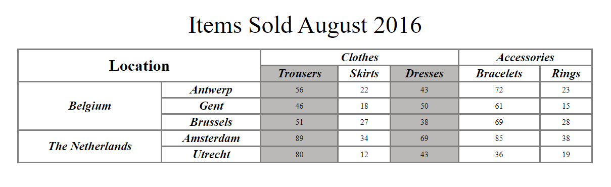

# Таблица

Таблица состоит из строк и столбцов и предназначена для структурирования данных. Часто в таблицах размещают однотипные данные.

В HTML для создания таблиц существует набор семантических тегов:

- `<table>`
- `<thead>`
- `<tbody>`
- `<tfoot>`
- `<th>`
- `<tr>`
- `<td>`

> HTML-таблицы следует использовать для табличных данных — это то, для чего они предназначены
---

# `<table>`

Самый важный тег для создания таблицы — это <table>
Встречая этот тег в разметке, браузер понимает, что дальше будет таблица
```html
<table>
...
</table>
```
---

# `<tr>`

Любая таблица в первую очередь состоит из строк. Чтобы в таблице появились строки, используйте парный тег `<tr>`

Сколько нужно строк — столько раз нужно написать `<tr>` внутри `<table>`

```html
<table>
  <tr></tr>
  <tr></tr>
  <tr></tr>
</table>
```

---

# `<td>`

Чтобы создать ячейку под данные, нужен парный тег `<td>`. Пишем столько `<td>` внутри `<tr>`, сколько нужно ячеек таблицы.

> Ячейки формируют из себя столбцы. В HTML нет специального тега для столбцов.

```html
<table>
  <tr>
    <td>iPhone 12 Pro</td>
    <td>$999</td>
  </tr>
  <tr>
    <td>iPhone 12</td>
    <td>$799</td>
  </tr>
  <tr>
    <td>iPhone 12 mini</td>
    <td>$699</td>
  </tr>
</table>
```

---

# `<th>`

Специально для заголовков ячеек или строк есть тег `<th>`, который заменяет тег `<td>`

```html
<table>
  <tr>
    <th>Модель</th>
    <th>Цена</th>
  </tr>
  <tr>
    <td>iPhone 12 Pro</td>
    <td>$999</td>
  </tr>
  <tr>
    <td>iPhone 12</td>
    <td>$799</td>
  </tr>
  <tr>
    <td>iPhone 12 mini</td>
    <td>$699</td>
  </tr>
</table>

```
> К ячейкам, обёрнутым тегом `<th>`, применяются дефолтные стили: текст становится жирным и выравнивается по центру ячейки

---

# `<caption>`

Если нужно подписать таблицу, дать ей определение, то можно использовать парный тег `<caption>`. В него помещается общая информация о таблице.

> Тег `<caption>` должен идти сразу после открывающего тега `<table>`.

```html
<table>
  <caption>Цены на флагманские модели iPhone и Xiaomi</caption>
</table>
```

---


# `<thead>`

Тег `<thead>` отвечает за шапку таблицы. Внутри этого тега могут располагаться одна или более строк с заголовками таблицы.

> `<thead>` должен располагаться в разметке сразу за открывающим `<table>` или после `<caption>`

```html
<table>
  <thead>
    <tr>
      <th>Модель</th>
      <th>Цена</th>
    </tr>
  </thead>
  <tr>
    <td>iPhone 12 Pro</td>
    <td>$999</td>
  </tr>
  <tr>
    <td>iPhone 12</td>
    <td>$799</td>
  </tr>
  <tr>
    <td>iPhone 12 mini</td>
    <td>$699</td>
  </tr>
</table>
```
> `<thead>` по своей семантике похож на тег `<header>`, только его «влияние» распространяется в пределах таблицы.

---

# `<tbody>`

Этот тег предназначен для основной части таблицы. Внутрь него помещаются строки с данными.
Можно использовать несколько `<tbody>` внутри таблицы, разделяя тем самым данные на отдельные блоки.

```html
<table>
  <thead>
    <tr>
      <th>Модель</th>
      <th>Цена</th>
    </tr>
  </thead>
  <tbody>
    <tr>
      <td>iPhone 12 Pro</td>
      <td>$999</td>
    </tr>
    <tr>
      <td>iPhone 12 mini</td>
      <td>$699</td>
    </tr>
  </tbody>
  <tbody>
    <tr>
      <td>Xiaomi Mi 10</td>
      <td>$768</td>
    </tr>
    <tr>
      <td>Xiaomi Black Shark 3 128 Gb</td>
      <td>$529</td>
    </tr>
  </tbody>
</table>

```

> Этот тег схож по семантике с `<main>`, но в пределах таблицы

---

# `<tfoot>`

Тег `<tfoot>` нужен для  некой строки с итогом данных таблицы.

> В таблице может быть только один блок `<tfoot>`.

```html
<table>
  <thead>
    <tr>
      <th>Модель</th>
      <th>Цена</th>
    </tr>
  </thead>
  <tbody>
    <tr>
      <td>Xiaomi Mi 10</td>
      <td>$768</td>
    </tr>
    <tr>
      <td>Xiaomi Black Shark 3 128 Gb</td>
      <td>$529</td>
    </tr>
  </tbody>
  <tfoot>
    <tr>
      <td>Средняя цена:</td>
      <td>$758.8</td>
    </tr>
  </tfoot>
</table>

```

> По семантике этот тег похож на `<footer>`, только в пределах таблицы.

---

# `colspan` и `rowspan`

Оба атрибута предназначены для объединения ячеек. 

- `colspan`  для объединения ячеек из 2 или более столбцов, 
- `rowspan` для объединения ячеек из 2 или более рядов.

```html
<table>
  <caption>Цены на флагманские модели iPhone и Xiaomi</caption>
  <thead>
    <tr>
      <th>Производитель</th>
      <th>Модель</th>
      <th>Цена</th>
    </tr>
  </thead>
  <tbody>
    <tr>
      <td rowspan="2">Xiaomi</td>
      <td>Mi 10</td>
      <td>$768</td>
    </tr>
    <tr>
      <td>Black Shark 3 128 Gb</td>
      <td>$529</td>
    </tr>
  </tbody>
  <tfoot>
    <tr>
      <td colspan="2">Средняя цена:</td>
      <td>$758.8</td>
    </tr>
  </tfoot>
</table>

```

---


# Стилизация таблиц

> У таблицы нет встроенных стилей для отображения границ ячеек. Используйте CSS-свойство `border`.

> Задать границы элементам `<tr>`, `<thead>`, `<tfoot>` и `<tbody>` нельзя, поэтому задавайте их тегам `<table>`, `<th>` или `<td>`.

---

# Стилизация столбцов

HTML позволяет указать, какой стиль нужно применять к целому столбцу данных сразу — для этого применяют элементы  `<col>` и `<colgroup>`

```html
<table>
  <colgroup>
    <col>
    <col style="background-color: yellow">
  </colgroup>
  <tr>
    <th>Data 1</th>
    <th>Data 2</th>
  </tr>
  <tr>
    <td>Calcutta</td>
    <td>Orange</td>
  </tr>
  <tr>
    <td>Robots</td>
    <td>Jazz</td>
  </tr>
</table>
```

Атрибуты `col`:

- `align` Устанавливает выравнивание содержимого колонки по краю.
- `char` Выравнивает содержимое колонки по заданному символу.
- `charoff` Сдвигает содержимое ячейки относительно заданного символа.
- `span` Количество колонок, к которым следует применять параметры.
- `valign` Задает вертикальное выравнивание содержимого колонки.
- `width` Ширина колонок.


---

# Задача




---

