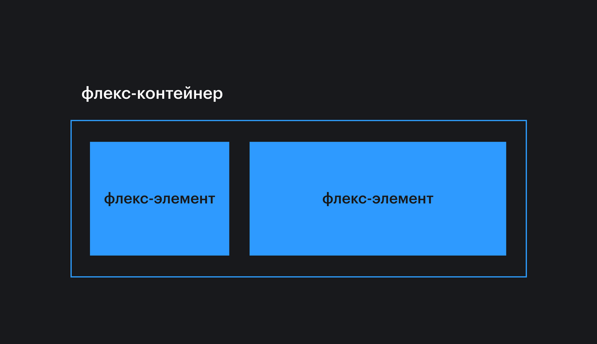
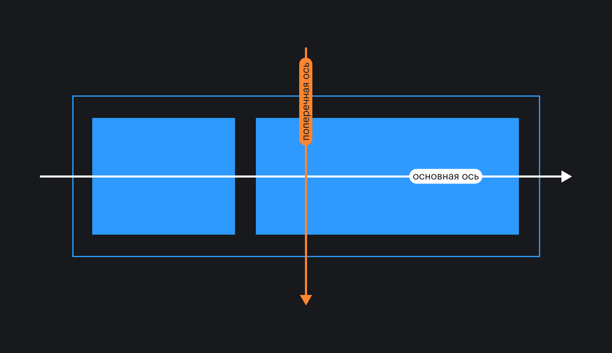
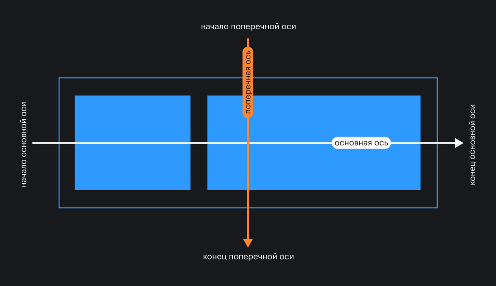
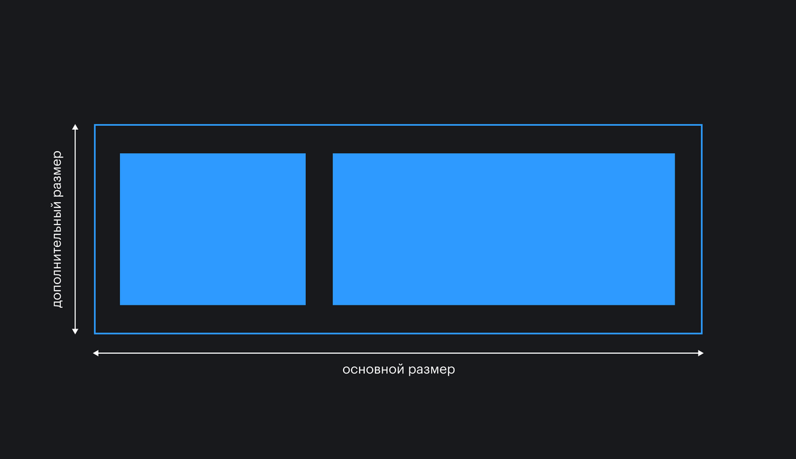
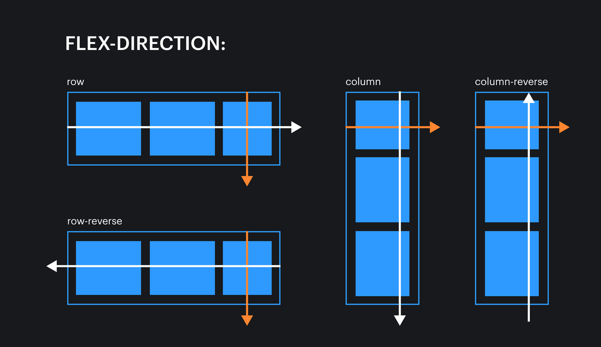
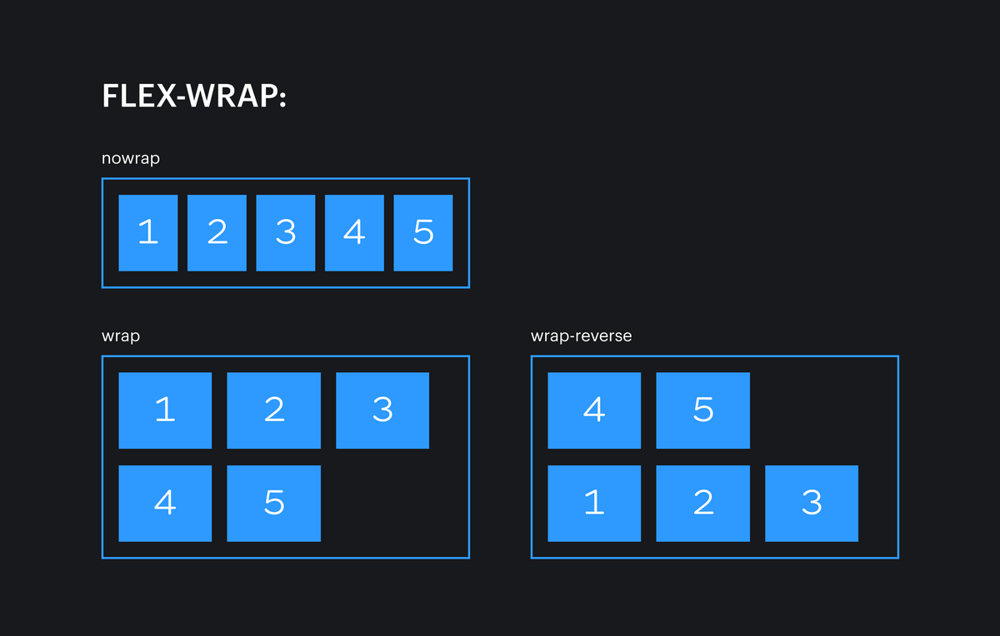
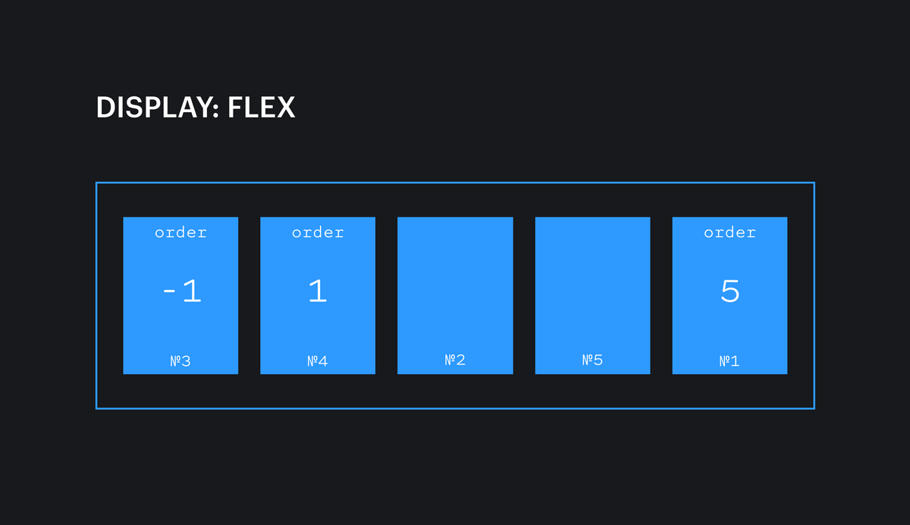

# Псевдоклассы

Псевдоклассы — особый вид селектора, который уточняет тип или состояние. Обычно это какой-то качественный признак: реакция на наведение курсора, порядок следования и другие.

```css
.block:hover {
  color: red;
}
:focus {
  color: lightblue;
}
```

---

# :hover

Псевдокласс применить стиль при наведении мыши на целевой элемент
```css
.link {
  color: #000;
  text-decoration: none;
}

.link:hover {
  color: pink;
  text-decoration: underline;
}
```

---

# :link

Псевдокласс `:link` используется для оформления ссылок, которые пользователь ещё никогда не открывал (в рамках текущего домена).

```css
a:link {
  color: blue;
}
```

---

# :visited

Псевдокласс `:visited` добавляется ссылкам, по которым уже переходил пользователь.

```css
a {
  color: green;
}

a:visited {
  color: purple;
}

```

---

# :active

Псевдокласс `:active` позволяет задать стили для элемента, с которым происходит взаимодействие прямо сейчас. Например, можно задать кнопке стиль, который будет виден в тот краткий миг, когда на кнопке зажата клавиша мыши.

```css
button {
  padding: 2.5rem;
  border: 0;
  border-radius: 2.5rem;
  font-size: 2.5rem;
  background-color: #bada55;
  cursor: pointer;
  transition: background 0.3s, color 0.3s;
}

button:active {
  color: white;
  background-color: purple;
}

```
---

# Псевдоклассы группы `child`

Псевдоклассы из этого набора:

- `:only-child` — выбирает любой элемент, который является единственным дочерним элементом своего родителя.
- `:first-child` — выбирает первый дочерний элемент в родителе.
- `:last-child` — выбирает последний дочерний элемент в родителе.

Псевдоклассы, несущие в себе сочетание букв `nth`, работают гораздо интереснее. Для их правильной работы нужно указать в скобках паттерн

- `:nth-child(odd)` — выбирает нечётные элементы внутри родителя, подходящие под левую часть селектора.
- `:nth-child(even)` — выбирает чётные элементы внутри родителя, подходящие под левую часть селектора.

> `:nth-child(3)`, `:nth-child(3n)`, `:nth-child(3n+10)`

# FlexBox

Основная идея флексов — гибкое распределение места между элементами, гибкая расстановка, выравнивание, гибкое управление. Ключевое слово — гибкое, что и отражено в названии (`flex` — англ. гибко).

---

# Основные термины

`Флекс-контейнер`: элемент, к которому применяется свойство `display: flex`. Вложенные в него элементы подчиняются правилам раскладки флексов.

`Флекс-элемент`: элемент, вложенный во `флекс-контейнер`.



---

# Оси

`Основная ось`: основная направляющая флекс-контейнера, вдоль которой располагаются флекс-элементы.

`Поперечная` (побочная, перпендикулярная) ось: ось, идущая перпендикулярно основной. Позже вы поймёте, для чего она нужна.



---

# Конечные точки

`Начало / конец основной оси`: точки в начале и в конце основной оси соответственно. Это пригодится нам для выравнивания флекс-элементов.

`Начало / конец поперечной оси`: точки в начале и в конце поперечной оси соответственно.



---

# Размеры

`Размер по основной оси` (основной размер): размер флекс-элемента вдоль основной оси. Это может быть ширина или высота в зависимости от направления основной оси.


`Размер по поперечной оси` (поперечный размер): размер флекс-элемента вдоль поперечной оси. Это может быть ширина или высота в зависимости от направления поперечной оси. Этот размер всегда перпендикулярен основному размеру. Если основной размер — это ширина, то поперечный размер — это высота, и наоборот.




---

# Свойства флекс-контейнера 

### display

```css
.container {
  display: flex;
}
.container {
  display: inline-flex;
}

```
Внутри контейнера начинает действовать флекс-контекст, его дочерние элементы начинают подчиняться свойствам флексбокса.

Снаружи флекс-контейнер выглядит как блочный элемент — занимает всю ширину родителя, следующие за ним элементы в разметке переносятся на новую строку.

> Если контейнеру задано значение `inline-flex`, то снаружи он начинает вести себя как строчный (инлайн) элемент — размеры зависят только от внутреннего контента, встаёт в строку с другими элементами. Внутри это ровно такой же флекс-контейнер, как и при предыдущем значении.

---

# Свойства флекс-контейнера 

### flex-direction

Свойство управления направлением основной и поперечной осей.

```css
.container {
  display: flex;
  flex-direction: row;
}
```
Возможные значения:

- `row` (значение по умолчанию) — основная ось идёт горизонтально слева направо, поперечная ось идёт вертикально сверху вниз.
- `row-reverse` — основная ось идёт горизонтально справа налево, поперечная ось идёт вертикально сверху вниз.
- `column` — основная ось идёт вертикально сверху вниз, поперечная ось идёт горизонтально слева направо.
- `column-reverse` — основная ось идёт вертикально снизу вверх, поперечная ось идёт горизонтально слева направо.



---


# Свойства флекс-контейнера 

### flex-wrap

Свойство указывает как ведут себя элементу внутри ряда (строки)

```css
.container {
  display: flex;
  flex-wrap: nowrap;
}
```
Возможные значения:

- `nowrap`   флекс-элементы помещаются (или пытаются уместиться) в один ряд и не переносятся в новый ряд, даже если не влезают в размеры родителя.
- `wrap` - флекс-элементы будут иметь возможность перенестись в новый ряд, если не влезают в одну линию в рамках родителя.
- `wrap-reverse` элементы будут располагаться снизу вверх, заполнив собой сперва нижний ряд, а те, что не влезли, перепрыгнут в ряд выше.



---

# Свойства флекс-контейнера 

### flex-flow

Это свойство-шорткат для одновременного определения значений свойств `flex-direction` и `flex-wrap`.

```css
.container {
  display: flex;
  flex-flow: column wrap;
}
.container2 {
  display: flex;
  flex-flow: row nowrap;
}
```

---


# Свойства флекс-контейнера 

### justify-content

Свойство позволяет выравнивать флекс-элементы внутри флекс-контейнера по `основной оси`.

```css

.container {
  display: flex;
  justify-content: space-between;
}
```
Возможные `значения`:


- `flex-start` (значение по умолчанию) — элементы прижимаются к краю, от которого начинается основная ось.
 - `flex-end` — элементы прижимаются к краю, у которого основная ось заканчивается.
 - `start` — элементы прижимаются к тому краю, откуда начинается чтение на том языке, на котором отображается сайт. Например, для русского языка элементы прижмутся к левому краю при горизонтальной основной оси, а для арабского языка — к правому краю.
 - `end` — элементы прижимаются к краю, противоположному началу направления чтения на том языке, на котором отображается сайт. Например, при горизонтальной основной оси на русском языке элементы прижмутся к правому краю.
 - `left` — элементы прижмутся к левому краю родителя. В случае, если указано свойство `flex-direction: column`, значение срабатывает как `start`.
 - `right` — элементы прижмутся к правому краю. В случае, если указано свойство `flex-direction: column`, значение срабатывает как end.
 - `center` — элементы выстраиваются по центру родителя.
 - `space-between` — крайние элементы прижимаются к краям родителя, оставшиеся выстраиваются внутри контейнера равномерно, так, чтобы между ними были одинаковые отступы.
 - `space-around` — свободное пространство делится поровну между элементами и по половине от этой доли размещается по бокам от каждого элемента. Таким образом, между соседними элементами будет равное расстояние, а снаружи крайних элементов — по половине этого расстояния.
 - `space-evenly` — свободное место будет распределено так, чтобы расстояние между любыми двумя элементами было одинаковым и расстояние от крайних элементов до края было таким же.

 ---

# Свойства флекс-контейнера 

### align-items 


```css
.container {
  display: flex;
  align-items: center;
}
```

Свойство выравнивания элементов внутри контейнера по поперечной оси.

Возможные значения:

- `stretch` (значение по умолчанию) — элементы растягиваются вдоль поперечной оси так, чтобы заполнить всего родителя. Это очень удобно, если вы делаете двухколоночный макет. Раньше приходилось при помощи разных костылей добиваться одинаковой высоты, а теперь достаточно сделать контейнер флексом, и колонки по умолчанию будут одной высоты.
 - `flex-start` или `start` — элементы выстраиваются у начала поперечной оси. Разница между ними лишь в том, что второе значение «уважает» направление чтения выбранного языка.
 - `flex-end` или `end` — элементы выстраиваются у конца поперечной оси. Разница между первым и вторым значениями аналогична предыдущему пункту.
 - `center` — элементы выстраиваются по центру поперечной оси.
 - `baseline` — элементы выравниваются по базовой линии текста. «Базовая линия» — `baseline` — воображаемая линия, проходящая по нижнему краю знаков шрифта (без учёта выносных элементов).


---

# Свойства флекс-контейнера 

### align-content

Свойство распределяет свободное пространство по поперечной оси между рядами флекс-элементов. 

```css
.container {
  display: flex;
  align-content: center;
}
```

> Не имеет видимого значения, если элементы располагаются в один ряд.

Возможные значения:

- `stretch` (значение по умолчанию) — ряды растягиваются одинаково, так, чтобы занять всё доступное пространство родителя.
 - `flex-start` / `start` — все ряды располагаются у начала поперечной оси. Первое значение не зависит от направления чтения текущего языка, в отличие от второго.
 - `flex-end` / `end `— все ряды располагаются у конца поперечной оси. end «уважает» направление чтения текущего языка.
 - `center` — ряды выравниваются по центру родителя.
 - `space-between` — первый ряд прижимается к началу поперечной оси, последняя — к концу поперечной оси, а остальные располагаются так, чтобы свободное пространство было поделено на отступы между ними равномерно.
 - `space-around` — отступы у каждого ряда равнозначны отступам у любого другого ряда.
 - `space-evenly` — отступы между рядами и от краёв родителя одинаковые.

---

# Свойства флекс-элемента 

### order

При помощи свойства order можно менять порядок отображения флекс-элементов внутри флекс-контейнера.

```css
.container {
  display: flex;
}

.item {
  order: 3;
}
```

По умолчанию элементы отображаются в том порядке, в котором они расположены в разметке, а значение свойства order равно 0.

Значение задаётся в виде целого отрицательного или положительного числа. Элементы встают по возрастающей.



---

# Свойства флекс-элемента 

### flex-grow

Это свойство указывает, может ли вырастать флекс-элемент при наличии свободного места, и насколько. По умолчанию значение равно 0. Значением может быть любое положительное целое число (включая 0).

```css
.container {
  display: flex;
}

.item {
  flex-grow: 1;
}
```

> Если у всех флекс-элементов будет прописано `flex-grow: 1`, то свободное пространство в контейнере будет равномерно распределено между всеми.

> Если при этом одному из элементов мы зададим `flex-grow: 2`, то он постарается занять в два раза больше свободного места, чем его соседи.

---

# Свойства флекс-элемента 

### flex-shrink

Свойство `flex-shrink` полностью противоположно свойству `flex-grow`. Если в контейнере не хватает места для расположения всех элементов без изменения размеров, то свойство `flex-shrink` указывает, в каких пропорциях элемент будет уменьшаться

> Значение по умолчанию — 1. Значением может быть любое целое положительное число (включая 0).

```css
.container {
  display: flex;
}

.item {
  flex-shrink: 3;
}

```

---

# Свойства флекс-элемента 

### flex-basis

Свойство `flex-basis` указывает на размер элемента до того, как свободное место будет распределено (`flex-grow`).

```css
.container {
  display: flex;
}

.item {
  flex-basis: 250px;
}

```

---


# Свойства флекс-элемента 

### flex

Свойство-шорткат, с помощью которого можно указать значение трёх свойств одновременно: `flex-grow`, `flex-shrink` и `flex-basis`. Первое значение является обязательным, остальные опциональны.

> Значение по умолчанию: `0 1 auto`, что расшифровывается как `flex-grow: 0`, `flex-shrink: 1`, `flex-basis: auto`.

```css
/* 0 0 auto */
flex: none;

/* Одно значение, число без единиц: flex-grow */
flex: 2;

/* Одно значение, ширина/высота: flex-basis */
flex: 10em;
flex: 30px;
flex: auto;
flex: content;

/* Два значения: flex-grow | flex-basis */
flex: 1 30px;

/* Два значения: flex-grow | flex-shrink */
flex: 2 2;

/* Три значения: flex-grow | flex-shrink | flex-basis */
flex: 2 2 10%;

/* Глобальные значения */
flex: inherit;
flex: initial;
flex: unset;
```

---


# Свойства флекс-элемента 

### align-self

При помощи этого свойства можно выровнять один или несколько элементов иначе, чем задано у родительского элемента. Например, в коде выше у родителя задано выравнивание вложенных элементов по верхнему краю родителя. А для элемента с классом `.item` мы задаём выравнивание по нижнему краю.

```css
.container {
  display: flex;
  align-items: flex-start;
}

.item {
  align-self: flex-end;
}
```
