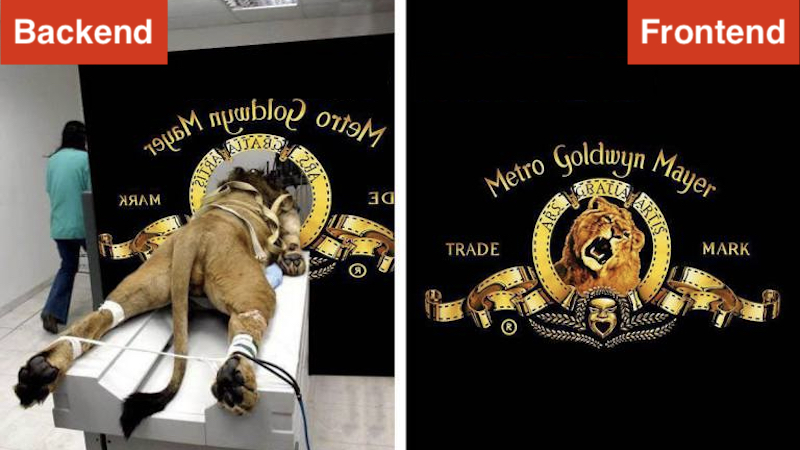
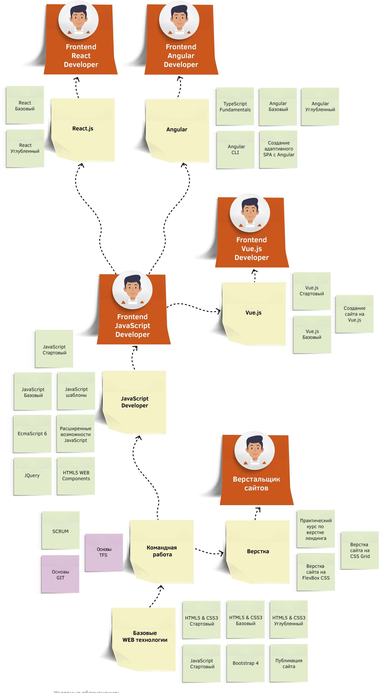
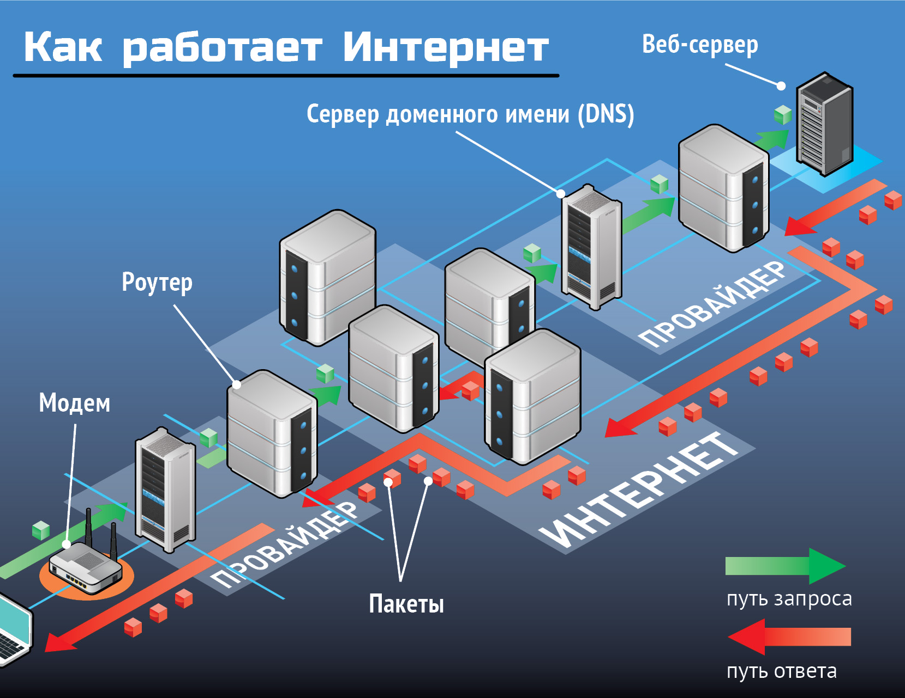
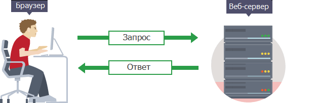
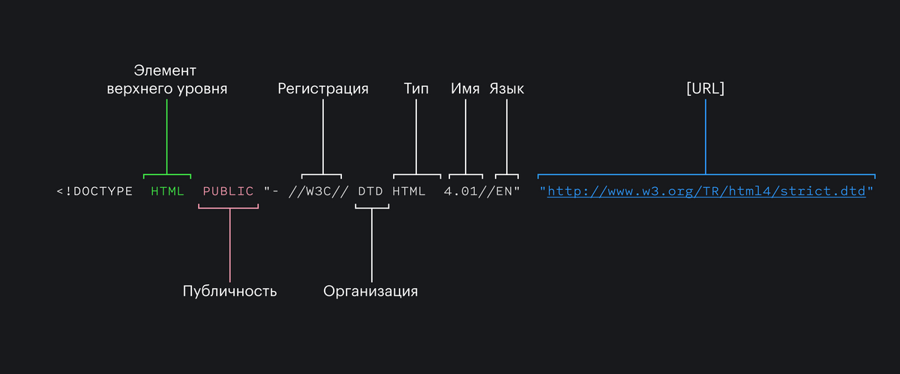
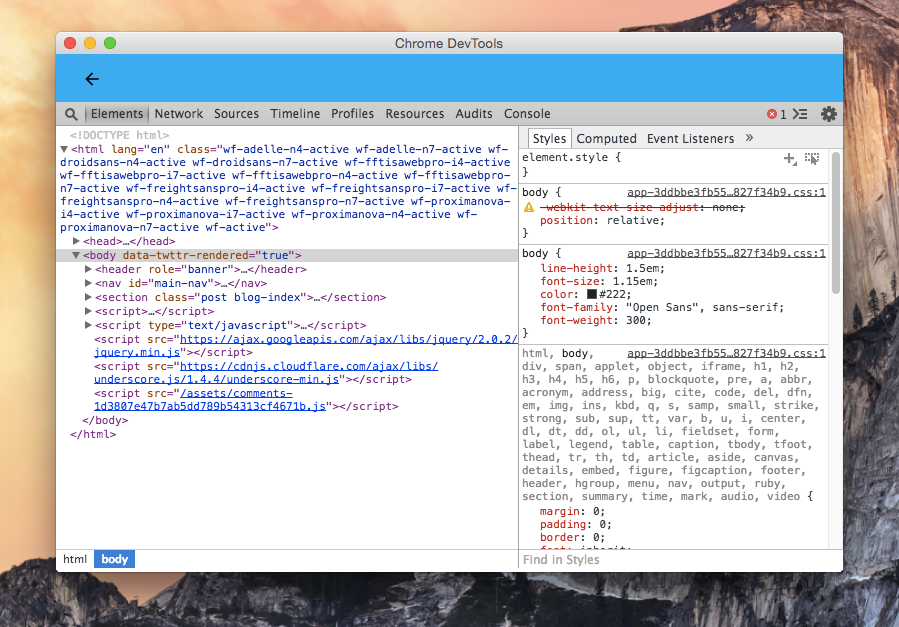
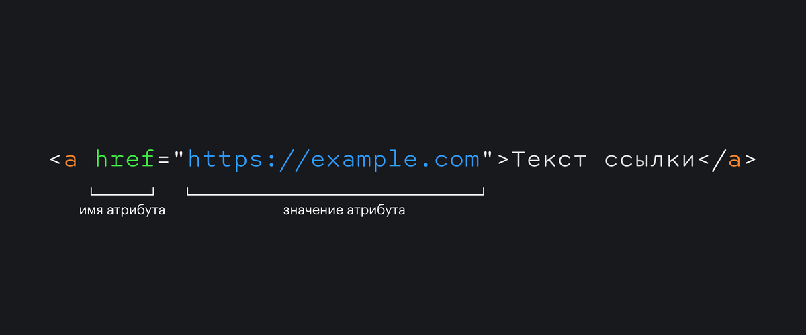

# Software development


---

# Начнём с азов

- `Front-end (frontend, фронтенд, фронт-энд)` — клиентская часть веба, интерфейс между машиной и пользователем. 
- `Back-end (backend, бэкенд, бэк-энд)` — программно–аппаратная часть Всемирной паутины.



---

# Что предстоит учить

Обязательный минимум фронтенд-разработчика
- `HTML` — язык гипертекстовой разметки. Иначе говоря – главный инструмент для создания внешнего облика веб-страницы: текст, картинки, таблицы, блоки и прочие базовые элементы дизайна. Сайты на чистом HTML уже не встречаются, но без знания этого языка во фронтенде делать нечего.

- `CSS` — по сути, набор шаблонов для форматирования страницы. Позволяет реализовать на веб-странице какой-то общий сценарий оформления, придать ей красивый и законченный вид без лишнего дублирования кода.

- `JavaScript` — в отличие от предыдущих представителей, это полноценный язык программирования, формально относящийся к фронт-енду. Фактически возможности JS куда шире организации «внешности», на нём можно создавать многие «серверные» фичи. Лишь бы у разработчика была фантазия, а в браузере стоял интерпретатор.

---

# Фреймворки `front-end`

Описать преимущества и недостатки любого из перечисленных здесь фреймворков в паре предложений почти невозможно

- `React.js` — данный фреймворк, как и многие другие фреймворки `frontend`, ориентирован на применение `JavaScript`. Чтобы в первом приближении оценить его, скажем одну вещь — он разрабатывается и активно применяется компанией `Facebook Inc`. Их социальная сеть и сервис `Instagram` — лучшая реклама `React.js`.

- `Angular` — продукт другой корпорации, `Google`. Получил большую популярность благодаря удобству и инструментам по созданию `material design` – тренду, не теряющему популярность уже более 5 лет.

- `Vue.js` — некое промежуточное звено между `Angular` и `React` как по популярности, так и по функциональности. Крупного покровителя не имеет, но обеспечивает такой уровень удобства, что на задачах начальной сложности вы будете считать его своей волшебной палочкой.

- `jQuery` — один из старейших фреймворков для `JavaScript`, наиболее распространён в современном вебе. 74% из 10 миллионов самых популярных сайтов было создано с использованием `jQuery`. Простота библиотеки позволяет легко внедрить простые `DOM` и анимацию за минимальное время с минимальной угрозой негативных последствий.

---

# Frontend



---

# За что любят фронтенд?
Можно выделить несколько основных причин:

- Есть возможность быстро получить визуальный результат своей работы. Здесь есть много пространства для творчества: визуализация своих идей, оптимизация решений, удобство пользования и др.
- Лёгкий старт. Чтобы попробовать что-нибудь из фронтенд-разработки, не нужны никакие специализированные программы, компиляторы, сложные настройки и прочее. Необходимо лишь желание и любой простейший текстовый редактор. Во фронтенде `IDE` лишь помогают визуализировать логику кода и упрощают его написание, но не являются обязательной средой разработки или компиляции.
- Много направлений для углубления знаний и развития: во время работы фронтенд-разработчик взаимодействует с дизайнерами, с бэкенд-разработчиками, тестировщиками, бизнес аналитиками, DevOps специалистами и так далее. При желании всегда можно немного отстраниться от фронтенда и попробовать себя в чём-то новом — предложить дизайн, настроить CI/CD, писать автотесты или при возможности пробовать бэкенд. 
- Постоянно нужно изучать что-то новое. Есть шутка о том, что во фронтенде каждый месяц появляется новый фреймворк. Это и плюс, и большой минус одновременно. С одной стороны, ты всегда сталкиваешься с чем-то новым и тебе приходится  учиться, пробовать и узнавать новые веяния, но с другой стороны, есть вероятность, что часть твоего опыта канет в небытие навсегда. В какой-то момент ты можешь устать всё время следить за трендами.

---

# Job Titles


---

# Path


---

# Как все это работает


---

# Internet



---

# Client <=> Server



---

# Html 

`HTML (Hypertext Markup Language)` - это код, который используется для структурирования и отображения веб-страницы и её контента

`HTML` не является языком программирования; это язык разметки, и используется, чтобы сообщать вашему браузеру, как отображать веб-страницы, которые вы посещаете. Он может быть сложным или простым, в зависимости от того, как хочет веб-дизайнер. `HTML` состоит из ряда элементов, которые вы используете, чтобы вкладывать или оборачивать различные части контента, чтобы заставить контент отображаться или действовать определённым образом

---

# Анатомия HTML элемента


- Открывающий тег (`Opening tag`): Состоит из имени элемента (в данном случае, `"p"`), заключённого в открывающие и закрывающие угловые скобки.  Открывающий тег указывает, где элемент начинается или начинает действовать, в данном случае — где начинается абзац.
- Закрывающий тег (`Closing tag`): Это то же самое, что и открывающий тег, за исключением того, что он включает в себя косую черту перед именем элемента. Закрывающий элемент указывает, где элемент заканчивается, в данном случае — где заканчивается абзац. Отсутствие закрывающего тега является одной из наиболее распространённых ошибок начинающих и может приводить к странным результатам.
- Контент (`Content`): Это контент элемента, который в данном случае является просто текстом.
- Элемент(`Element`): Открывающий тег, закрывающий тег и контент вместе составляют элемент.

# Элементы также могут иметь атрибуты


Атрибуты содержат дополнительную информацию об элементе, которую вы не хотите показывать в фактическом контенте. В данном случае, `class` это имя атрибута, а `editor-note` это значение атрибута. Класс позволяет дать элементу идентификационное имя, которое может позже использоваться, чтобы обращаться к элементу с информацией о стиле и прочих вещах.

### Атрибут всегда должен иметь:

- Пробел между ним и именем элемента (или предыдущим атрибутом, если элемент уже имеет один или несколько атрибутов).
- Имя атрибута, за которым следует знак равенства.
- Значение атрибута, заключённое с двух сторон в кавычки.

---

# Вложенные элементы

Вы также можете располагать элементы внутри других элементов — это называется вложением. Если мы хотим заявить, что наша кошка очень раздражена, мы можем заключить слово "очень" в элемент `<strong>` , который указывает, что слово должно быть сильно акцентированно:
```hml
<p>Моя кошка <strong>очень</strong> раздражена.</p>
```
> Нужно следить за вложенностью и закрытием элементов

---

# Пустые элементы

Некоторые элементы не имеют контента, и называются пустыми элементами. Возьмём элемент ``:

```html

```

Он содержит два атрибута, но не имеет закрывающего тега `</img>`, и никакого внутреннего контента. Это потому, что элемент изображения не оборачивает контент для влияния на него. Его целью является вставка изображения в HTML страницу в нужном месте.

---

# Анатомия HTML документа

Мы завершили изучение основ отдельных HTML элементов, но они не очень полезны сами по себе. Теперь мы посмотрим, как отдельные элементы объединяются в целую HTML страницу

```html
<!DOCTYPE html>
<html>
  <head>
    <meta charset="utf-8">
    <title>Моя тестовая страница</title>
  </head>
  <body>
  <p>Hello world</p>
  </body>
</html>
```

Разберемся:

- `<!DOCTYPE html>` — доктайп. В прошлом, когда HTML был молод (около 1991/1992), доктайпы должны были выступать в качестве ссылки на набор правил, которым HTML страница должна была следовать, чтобы считаться хорошим HTML, что могло означать автоматическую проверку ошибок и другие полезные вещи. Однако в наши дни, никто не заботится об этом, и они на самом деле просто исторический артефакт, который должен быть включён для того, что бы все работало правильно. На данный момент это все, что вам нужно знать.
- `<html></html>` — элемент `<html>`. Этот элемент оборачивает весь контент на всей странице, и иногда известен как корневой элемент.
- `<head></head>` — элемент `<head>`. Этот элемент выступает в качестве контейнера для всего, что вы пожелаете включить на `HTML` страницу, но не являющегося контентом, который вы показываете пользователям вашей страницы. К ним относятся такие вещи, как ключевые слова и описание страницы, которые будут появляться в результатах поиска, `CSS` стили нашего контента, кодировка и многое другое.
- `<body></body>` — элемент <body>. В нем содержится весь контент, который вы хотите показывать пользователям, когда они посещают вашу страницу, будь то текст, изображения, видео, игры, проигрываемые аудиодорожки или что-то ещё.
- `<meta charset="utf-8">` — этот элемент устанавливает `UTF-8` кодировку вашего документа, которая включает в себя большинство символов из всех известных человечеству языков. По сути, теперь документ может обрабатывать любой текстовый контент, который вы в него вложите. Нет причин не устанавливать её, так как это может помочь избежать некоторых проблем в дальнейшем.
- `<title></title>` — элемент `<title>`. Этот элемент устанавливает заголовок для вашей страницы, который является названием, появляющимся на вкладке браузера загружаемой страницы, и используется для описания страницы, когда вы добавляете её в закладки/избранное.

---

# <!DOCTYPE>

`<!DOCTYPE>` или «доктайп» — это сокращение от «тип документа» (`document type`). Доктайп говорит браузеру: «работай со страницей в стандартном режиме, пожалуйста». Единственный доктайп, который вам нужно знать — это `<!DOCTYPE html>`. Поставьте его первой строчкой HTML-документа, и браузер обработает страницу правильно.

```html
<!DOCTYPE html>
<html lang="ru">
  <head>
    <meta charset="UTF-8">
    <meta name="viewport" content="width=device-width,initial-scale=1">
    <title>Дока</title>
    <link rel="stylesheet" href="/assets/styles/main.css">
  </head>
</html>
```



Сегодня доктайп по спецификации нужен исключительно потому, что без него браузеры переключатся в режим совместимости со старым кодом (`quirks mode`). Поверьте, вы не хотите оказаться в режиме совместимости. Чтобы переключить браузер в стандартный режим (`standards mode`), достаточно написать в самом начале документа: `<!DOCTYPE html>`. Это единственный стандартный доктайп для современного HTML

---

# HTML

Элемент `<html>` открывает контейнер, в котором находится всё содержимое страницы. Это корневой, или родительский, элемент всего документа.

> Тег `<html>` ставят сразу после `<!DOCTYPE>`

```html
<!DOCTYPE html>
<html>
  <head>
    ...
  </head>
  <body>
    ...
  </body>
</html>
```
### Aтрибуты

- `manifest` — указывает `URI (унифицированный идентификатор ресурса)` манифеста, который сообщает браузеру, какие элементы страницы могут быть закэшированы.
- `title` — добавляет всплывающую подсказку, которая появляется, когда курсор мыши задерживается в окне веб-страницы.
- `version` — определяет версию шаблона HTML-документа, но необходимости в этом нет (устарел в HTML4.01; вышел из употребления с версии HTML5).
- `xmlns` — необязательный для HTML5, но необходимый для XHTML-документов атрибут. Определяет пространство имён XML, в котором находится документ.
- `prefix` — здесь прописывают open-graph разметку, типа `<html lang="ru-RU" prefix="og: [http://ogp.me/ns#](http://ogp.me/ns#)">`. Это чтобы при репосте с сайта в VK, Facebook и другие соцсети передавались те заголовки, картинки и описания, которые мы укажем.

---

# head

Элемент `<head>` содержит основную информацию о документе: метаданные (например, заголовок окна или кодировку), ссылки на скрипты и таблицы стилей.

> Эта информация не отображается на странице браузера

```html
<html>
  <head>
    <title>Заголовок страницы</title>
  </head>
</html>
```

Пользователи увидят только заголовок окна страницы — его задаёт тег `<title>`

> Кроме `<title>`, внутри контейнера `<head>` можно разместить и другие элементы: `<base>`, `<link>`, `<meta>`, `<script>`, `<style>`

---

# title

Чтобы дать документу название, используй элемент `<title>`. Название, или заголовок документа, будет видно только в строке заголовка браузера или на вкладке страницы.

Из названия страницы `<title>` пользователь узнаёт, что на ней находится. Если он захочет добавить страницу в избранное, то браузер предложит <title> в качестве названия закладки.
```html
<head>
  <title>Заголовок твоей страницы</title>
</head>

```
---
# meta

В теге `<meta>` хранится краткое описание страницы, ключевые слова и другие данные, которые могут понадобиться браузерам и поисковым системам.

Таких метатегов может быть любое количество. Все они размещаются внутри тега `<head>`, желательно в самом начале.
```html
<head>
  <meta name="description" content="Краткое описание страницы">
  <meta
    name="keywords"
    content="ключевое слово 1, ключевое слово 2, ключевое слово 3"
  >
  <meta name="viewport" content="width=device-width, initial-scale=1.0">
</head>
```

Атрибуты
- `charset` — задаёт кодировку страницы. Мы рекомендуем писать здесь UTF-8 — это самый распространённый вариант. `<meta charset="UTF-8">`

> Есть много других аттрибутов, их мы рассмотрим позже

---

# body

Элемент `<body>` содержит весь контент, который появится на странице: текст, изображения, теги, скрипты JavaScript и так далее.

В вашем документе может быть только один `<body>` и `<head>`.

```html
<!DOCTYPE html>
<html lang="ru">
  <head>
    <title>Название документа</title>
  </head>
  <body>
    <p>Здесь вы напишете текст</p>
  </body>
</html>
```

> Элемент `<body>` ставят сразу после закрывающего `</head>`.

---

# IDEs & Editors

[WebStorm](https://www.jetbrains.com/webstorm/) — мощная IDE для продвинутой разработки веб-приложений на JavaScript. Она предлагает поддержку различных фреймворков и языков разметки. WebStorm может быть легко интегрирован с дополнительными инструментами вроде тестеров, средств контроля качества кода, сборщиков и т. д. В IDE также встроены такие функции, как автоматическое завершение кода, немедленное обнаружение ошибок, навигация, встроенный терминал, богатый набор плагинов и многое другое.

[Atom](https://atom.io/) — бесплатный продукт от GitHub и выбор №1 для многих разработчиков. Он представляет собой легко настраиваемый редактор кода, который поставляется с некоторыми интересными функциями «прямо из коробки». В Atom имеется встроенный менеджер пакетов, интеллектуальное автоматическое завершение кода и прочие полезные функции. Также Atom является кроссплатформенным редактором кода.

[Visual Studio Code](https://code.visualstudio.com/) — поддерживается компанией Microsoft и полностью поддерживает TypeScript «прямо из коробки». В Visual Studio Code есть интеллектуальное завершение кода и подсветка синтаксиса с помощью технологии автодополнения IntelliSense, также есть встроенный инструмент отладки, встроенная поддержка команд Git, контроль версий и многое другое. Более того, вы можете расширить функциональность редактора путём подключения широкого спектра расширений.

[Brackets](http://brackets.io/) — это лёгкий редактор кода с открытым исходным кодом.  В основном он ориентирован на визуальные инструменты и поддержку процессора для упрощения работы в браузере. Brackets поставляется с удобной функцией предварительного просмотра в реальном времени.

[Sublime Text](https://www.sublimetext.com/) — проприетарный текстовый редактор. Поддерживает плагины на языке программирования Python. Разработчик позволяет бесплатно и без ограничений ознакомиться с продуктом, однако программа уведомляет о необходимости приобретения лицензии

[Notepad++](https://notepad-plus-plus.org/downloads/) - свободный текстовый редактор с открытым исходным кодом для Windows с подсветкой синтаксиса. 

---

# Dev tools



---

# Разметка текста

- Заголовки
- Абзацы
- Списки
- Ссылки


---

# `<h1>...<h6>`

Используй теги от `<h1>` до `<h6>`, чтобы размечать заголовки на странице.

```html
<h1>Самый важный заголовок</h1>
<h2>Заголовок уровня 2</h2>
<h3>Заголовок уровня 3</h3>
<h4>Заголовок уровня 4</h4>
<h5>Заголовок уровня 5</h5>
<h6>Заголовок уровня 6</h6>
```

Цифра в теге означает уровень заголовка в иерархии: от самого общего или главного `<h1>` до самого второстепенного `<h6>`.

По умолчанию `<h1>` — самый крупный заголовок на странице, а `<h6>` — самый мелкий.

```html
<h1>Каталог тортов</h1>
<p>
  У нас вы можете заказать самые вкусные десерты от свадебных тортов до сочных
  тартов.
</p>

<h2>Свадебные торты</h2>
<p>Выберите начинку и внешний вид для торта своей мечты.</p>
```

---

# `<p>`

Тег `<p>` предназначен для абзацев текста, вы будете использовать их регулярно при разметке текстового контента:

```html
<p>Это первый абзац текста.</p>
<p>А это уже второй.</p>
<p>И между ними небольшая пропасть.</p>

```

---

# Списки

Большая часть веб-контента является списками и HTML имеет специальные элементы для них. Разметка списка всегда состоит по меньшей мере из двух элементов. Наиболее распространёнными типами списков являются нумерованные и ненумерованные списки:

- Ненумерованные списки - это списки, где порядок пунктов не имеет значения, как в списке покупок. Они оборачиваются в элемент `<ul>`.
- Нумерованные списки - это списки, где порядок пунктов имеет значение, как в рецепте. Они оборачиваются в элемент `<ol>`.

---

# `<ul>`

Если нам нужно сверстать перечень однотипных элементов, порядок которых неважен, мы будем использовать тег неупорядоченного списка `<ul>`.

Частный случай неупорядоченного списка — маркированный список.

```html
<ul>
  <!-- Содержимое -->
</ul>
```

Тег `<ul>` является своеобразной обёрткой, указывающей браузеру на начало и конец списка. Сами пункты списка размечаются при помощи тега `<li>`. Таким образом, полностью список верстается с использованием обоих этих тегов:

```html
<ul>
  <li>Молоко</li>
  <li>Хлеб</li>
</ul>
```

> Обратите внимание, что дочерними тегами для тега `<ul>` могут быть исключительно теги `<li>`. Любые другие теги обязательно должны находиться внутри пунктов списка `<li>`.

Пример

```html
<ul>
  <li>Молоко</li>
  <li>
    Хлеб
    <!-- В этот пункт вложен еще один полноценный список: -->
    <ul>
      <li>Белый</li>
      <li>Ржаной</li>
    </ul>
  <!-- Закрывающий тег родительского пункта: -->
  </li>
</ul>
```

---

# `<ol>`

Тег упорядоченного списка `<ol>` используется для вёрстки перечня однотипных элементов, когда важен их порядок.

```html
<ol>
  <!-- Содержимое -->
</ol>
```
Тег `<ol>` обозначает начало и конец списка. Сами пункты списка размечаются при помощи тега `<li>`. Таким образом, полностью список размечается с использованием обоих этих тегов:

```html
<ol>
  <li>Первая мировая война</li>
  <li>Вторая мировая война</li>
</ol>
```

---

# Ссылки

Ссылки очень важны — это то, что делает Интернет Интернетом. Чтобы добавить ссылку, нам нужно использовать простой элемент — `<a>` — a это сокращение от `"anchor"` ("якорь").

Чтобы текст в вашем абзаце стал ссылкой, выполните следующие действия:

- Выберите некоторый текст. Мы выбрали текст `"Манифест Mozilla"`.
- Оберните текст в элемент `<a>`, например так:
    ```html
    <a>Манифест Mozilla</a>
    ```
- Задайте элементу `<a>` атрибут `href`, например так:
  ```html
    <a href="">Манифест Mozilla</a>
  ```
- Заполните значение этого атрибута веб-адресом, на который вы хотите указать ссылку:
    ```html
    <a href="https://www.mozilla.org/ru/about/manifesto/details/">Манифест Mozilla</a>
    ```

### Структура



> Тег `<a>` превращает любой объект в ссылку.
> 
> Cуществует множество аттрибутов тега `<a>` их мы рассмортим позже

---

# img

Тег `` добавляет изображение на страницу.

> Тег `` одиночный, у него нет закрывающей пары, контент в него не положить.

### Атрибуты

- `src` Обязательный атрибут. В качестве значения указывается адрес картинки. Абсолютная или относительная ссылка до файла в любом допустимом формате.
- `alt` Тоже обязательный атрибут. Текст в `alt` называется альтернативным описанием изображения и рассказывает словами, что изображено. Это полезно, если картинка не загрузилась или пользователь не видит изображения.

```html

```

---

# Форматирование текста

- `<br>`
- `<hr>`
- `<b>`
- `<i>`
- `<s>`
- `<u>`
- `<strong>`
- `<em>`
- `<small>`

---

# `br`

Спорный тег `<br>` указывает на место разрыва строки и принудительного переноса текста на новую строку

>  И только для этих целей он должен применяться.

```html
<p>
  Мой дядя самых честных правил,<br>
  Когда не в шутку занемог,<br>
  Он уважать себя заставил<br>
  И лучше выдумать не мог.
</p>
``` 

---

# `hr `

Та самая горизонтальная черта, которая разделяет смысловые блоки на странице.

```html
<p>Первый абзац</p>
<hr>
<p>Второй абзац</p>
```

---

# `b`

Тег `<b></b>` используется для привлечения внимания к части текста без добавления какой-либо важности или изменения тона: например, если мы хотим визуально выделить ключевые слова, названия продуктов в обзорах, вводные части статей.

> По умолчанию браузеры применяют к `<b>` жирное начертание
> 
```html
<p>
  В лидеры обзора вышли
  <b>MDR-V6</b> и <b>ATH-M50x</b>,
  одни из самых популярных
  мониторных наушников.
</p>
```

---

# `i`

Тег `<i>` используется для изменения голоса или настроения части текста, чтобы передать его другое качество: официальное название, идиома из другого языка, транслитерация или ремарки.

> По умолчанию браузеры применяют к `<i>` курсивное начертание

```html
<p>
  Кабанов <i>(вздыхая в сторону)</i>. Ах ты, господи! <i>(Матери.)</i> Да смеем ли мы, маменька, подумать!
</p>
```

---

# `s`

Тег `<s>` обозначает содержимое, которое уже не корректно или потеряло актуальность.

```html
<p>
  Для тех кто хочет меня нанять — я
  <s>работаю минимум за 1000 ₽/час</s>
  готов работать за еду.
</p>
```

> По умолчанию браузеры применяют к `<s>` перечёркивание

---

# `u`

Тег `<u>` предназначен для выделения фрагмента текста, который стилистически отличается от остального текста. Например, слова с орфографическими ошибками или имена в китайском языке (по правилам их принято подчёркивать).

```html
<p>
  В человеке должно быть всё
  прекрасно: и <u>лецо</u>,
  и одежда, и душа, и мысли.
</p>
```
> По умолчанию браузеры добавляют тексту в `<u>` подчёркивание

---

# strong

Тег `<strong>` добавляет обёрнутому в него слову или фразе очень высокую важность. Он может использоваться для выделения предупреждений или части документа, которую пользователь должен увидеть раньше остального. При этом обозначение части текста тегом `<strong>` не должно изменять смысла предложения.

```html
<p>Эта правка <strong>критически важна</strong> для проекта!</p>
```

> Теги `<strong>` и `<b>` внешне похожи: оба по умолчанию выделяют текст жирным. Но по смыслу эти теги отличаются. Тег `<b>` только внешне выделяет текст, а тег `<strong>` добавляет важности обёрнутому в него тексту.


>Не используйте тег `<strong>` только для визуального выделения текста.

---

# em

Тег `<em>` выделяет слово или фразу, на которой нужно сделать смысловой акцент в тексте.

```html
<p>Это просто <em>невозможно</em> физически.</p>
```

> Теги `<em>` и `<i>` внешне похожи: оба по умолчанию имеют курсивное начертание. Но по смыслу эти теги отличаются. Тег `<i>` только внешне выделяет текст, а тег `<em>` добавляет семантическое ударение обёрнутому в него тексту.

> Не стоит использовать тег `<em>` в чисто декоративных целях.

---

# small

Тег `<small>` используется для вывода текста мелким шрифтом. Обычно его используют для пояснений или небольших комментариев.

```html
<p>
  JavaScript — это лучший язык программирования в мире!<br>
  <small>Но это не точно</small>
</p>
```

> `<small>` следует использовать для небольших пояснений или комментариев, которые дополняют или раскрывают предшествующий текст.

Он `НЕ` подойдёт, если нам нужно:

- Убрать интонационное выделение, создаваемое тегами `<em>` или `<strong>`. Если нужно показать, что какой то отрывок текста «не важен», то его просто не нужно оборачивать в `<em>` или `<strong>`.
- Добавить подзаголовок. Для этого стоит использовать теги заголовков соответствующего уровня.
- Вывести длинный отрывок текста маленьким шрифтом, например, пользовательское соглашение. Для эти целей блок с пользовательским соглашением лучше стилизовать отдельно.

Для чего `<small>` подойдёт идеально:

- пояснения;
- комментарии;
- дисклеймеры;
- предостережения;
- копирайт;
- информация о лицензии;
- прочая правовая информация.
