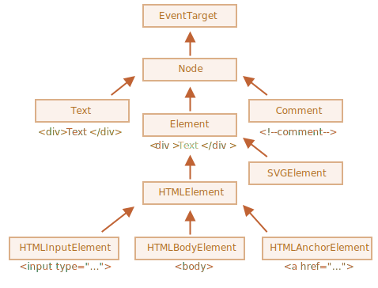

# Браузерное окружение

Сегодня JavaScript может использоваться в браузере, на веб-сервере или в какой-то другой среде, даже в кофеварке. Каждая среда предоставляет свою функциональность, которую спецификация JavaScript называет окружением.


Как мы видим, имеется корневой объект `window`, который выступает в 2 ролях:

- Во-первых, это глобальный объект для `JavaScript-кода`, об этом более подробно говорится в главе `Глобальный объект`.
- Во-вторых, он также представляет собой окно браузера и располагает методами для управления им.

```javascript
function sayHi() {
  alert("Hello");
}

// глобальные функции доступны как методы глобального объекта:
window.sayHi();
alert(window.innerHeight); // внутренняя высота окна браузера

```
---

# DOM

`DOM (Document Object Model)` — это специальная древовидная структура, которая позволяет управлять HTML-разметкой из JavaScript-кода. Управление обычно состоит из добавления и удаления элементов, изменения их стилей и содержимого.

> Браузер создаёт `DOM` при загрузке страницы, складывает его в переменную `document` и сообщает, что `DOM` создан, с помощью события `DOMContentLoaded`. С переменной `document` начинается любая работа с HTML-разметкой в `JavaScript`.

DOM – это представление HTML-документа в виде дерева тегов. Вот как оно выглядит:
```html
<!DOCTYPE html>
<head>
  <title>Личный кабинет</title>
</head>
<body>
  <header>
    <ul class="menu">
      <li>Главная</li>
      <li>Статьи</li>
      <li>Контакты</li>
    </ul>
  </header>
  <article id="12">
    <h1>Как выучить джаваскрипт?</h1>
    <p>Нужно начать учиться.</p>
  </article>
</body>

```


---

# Типы узлов

- ELEMENT_NODE
- ATTRIBUTE_NODE
- TEXT_NODE
- CDATA_SECTION_NODE
- ENTITY_REFERENCE_NODE// legacy
- ENTITY_NODE// legacy
- PROCESSING_INSTRUCTION_NODE
- COMMENT_NODE
- DOCUMENT_NODE
- DOCUMENT_TYPE_NODE
- DOCUMENT_FRAGMENT_NODE
- NOTATION_NODE

### Чаще всего используются 4
- document
- узлы-элементы
- текстовые узлы
- комментарии 

---

# document

Объект `document` содержит большое количество свойств и методов, которые позволяют работать с HTML. Чаще всего используются методы, позволяющие найти элементы страницы.

### Свойства

- `documentElement` - верхний узел документа, В `DOM` он соответствует тегу `<html>`.
- `title` — заголовок документа. Браузер обычно показывает его на вкладке.
- `forms` — получить список форм на странице. Свойство только для чтения, напрямую перезаписать его нельзя.
- `body` — получить `body` элемент страницы 
- `head` — получить `head` элемент страницы

### Методы

- `getElementById` — поиск элемента по идентификатору;
- `getElementsByClassName` — поиск элементов по названию класса;
- `getElementsByTagName` — поиск элементов по названию тега;
- `querySelector` — поиск первого элемента, подходящего под `CSS-селектор`;
- `querySelectorAll` — поиск всех элементов подходящих под `CSS-селектор`.

---

# DOM навигация


### Дети: `childNodes`, `firstChild`, `lastChild`

Здесь и далее мы будем использовать два принципиально разных термина:

- Дочерние узлы (или дети) – элементы, которые являются непосредственными детьми узла. Другими словами, элементы, которые лежат непосредственно внутри данного. Например, <head> и <body> являются детьми элемента <html>.
- Потомки – все элементы, которые лежат внутри данного, включая детей, их детей и т.д.

Навигация по нодам:

- Коллекция `childNodes` содержит список всех детей, включая `текстовые узлы`.
- Свойства `firstChild` и `lastChild` обеспечивают быстрый доступ к первому и последнему дочернему элементу.

---

# NodeList

Объект `NodeList` — это коллекция узлов, возвращаемая такими методами, как `Node.childNodes` и `document.querySelectorAll`.

### Свойства

- `length` Количество элементов в `NodeList`.

### Методы
- `item ( idx )` - Возвращает элемент из списка по его индексу или `null`, если индекс выходит за границы допустимого диапазона. Может быть использован как альтернатива `nodeList[idx]`, возвращающему `undefined` при недопустимом `idx`.
- `entries()` - Возвращает `iterator`, позволяя перебрать все пары ключ/значение, содержащиеся в объекте.
- `forEach()` - Выполняет указанную функцию один раз для каждого элемента `NodeList`
- `keys()` - Возвращает `iterator`, позволяя перебрать все ключи каждой пары `ключ/значение`, содержащейся в объекте.
- `values()` - Возвращает `iterator`, позволяя перебрать все значения каждой пары `ключ/значение`, содержащейся в объекте.

> Однако некоторые старые браузеры на данный момент все ещё не поддерживают `NodeList.forEach()` или `Array.from()`.

---

# Соседние узлы

`Соседи` – это узлы, у которых один и тот же родитель.

```html
<html>
  <head>...</head><body>...</body>
</html>
```

Навигация по узлам:

- Свойство `Node.previousSibling` используется только для чтения, оно возвращает узел предшествующий указанному в родительском элементе `childNodes`, или `null`, если указанный узел первый в своём родителе.
- Свойство `Node.nextSibling` используется только для чтения и возвращает узел, непосредственно следующий за данным узлом в списке `childNodes` его родительского элемента, или `null` если данный узел последний в этом списке.
- Свойство `Node.parentNode` Возвращает родителя определённого элемента DOM дерева.
- 
> `Document` и `DocumentFragment nodes` могут не иметь родителя, в этом случае `parentNode` всегда возвращает `null`.
> Так же возвращает `null` если элемент только был создан и ещё не добавлен в `DOM` дерево.

---

# Навигация только по элементам

Навигационные свойства, описанные выше, относятся ко всем узлам в документе. В частности, в `childNodes` находятся и текстовые узлы и узлы-элементы и узлы-комментарии, если они есть.

Но для большинства задач текстовые узлы и узлы-комментарии нам не нужны. Мы хотим манипулировать узлами-элементами, которые представляют собой теги и формируют структуру страницы.


- `children` – коллекция детей, которые являются элементами.
- `firstElementChild`, `lastElementChild` – первый и последний дочерний элемент.
- `previousElementSibling`, `nextElementSibling` – соседи-элементы.
- `parentElement` – родитель-элемент.

---

# Eще немного навигации

- Метод `elem.matches(css)` ничего не ищет, а проверяет, удовлетворяет ли `elem` `CSS-селектору`, и возвращает `true` или `false`.
> Этот метод удобен, когда мы перебираем элементы (например, в массиве или в чём-то подобном) и пытаемся выбрать те из них, которые нас интересуют.
- Метод `elem.closest(css)` ищет ближайшего предка, который соответствует `CSS-селектору`. Сам элемент также включается в поиск.
> Другими словами, метод `closest` поднимается вверх от элемента и проверяет каждого из родителей. Если он соответствует селектору, поиск прекращается. Метод возвращает либо предка, либо `null`, если такой элемент не найден.

---

# Классы DOM-узлов



Существуют следующие классы:

- `EventTarget` – это корневой «абстрактный» класс. Объекты этого класса никогда не создаются. Он служит основой, благодаря которой все DOM-узлы поддерживают так называемые «события», о которых мы поговорим позже.
- `Node` – также является «абстрактным» классом, и служит основой для DOM-узлов. Он обеспечивает базовую функциональность: `parentNode, nextSibling, childNodes` и т.д. (это геттеры). Объекты класса `Node` никогда не создаются. Но есть определённые классы узлов, которые наследуют от него: `Text` – для текстовых узлов, `Element` – для узлов-элементов и более экзотический `Comment` – для узлов-комментариев.
- `Element` – это базовый класс для DOM-элементов. Он обеспечивает навигацию на уровне элементов: `nextElementSibling`, `children` и методы поиска: `getElementsByTagName`, `querySelector`. Браузер поддерживает не только `HTML`, но также `XML` и `SVG`. Класс `Element` служит базой для следующих классов: `SVGElement, XMLElement и HTMLElement`.
- `HTMLElement` – является базовым классом для всех остальных HTML-элементов. От него наследуют конкретные элементы:
  - `HTMLInputElement` – класс для тега `<input>`,
  - `HTMLBodyElement` – класс для тега `<body>`,
  - `HTMLAnchorElement` – класс для тега `<a>`,
…и т.д, каждому тегу соответствует свой класс, который предоставляет определённые свойства и методы.

---

# Console

Большинство браузеров поддерживают в инструментах разработчика две команды: `console.log` и `console.dir`. Они выводят свои аргументы в консоль. Для JavaScript-объектов эти команды обычно выводят одно и то же.

> Но для DOM-элементов они работают по-разному:

- `console.log(elem)` выводит элемент в виде DOM-дерева.
- `console.dir(elem)` выводит элемент в виде DOM-объекта, что удобно для анализа его свойств.

---

# Свойства узлов

Свойство `nodeType` предоставляет, «старомодный» способ узнать «тип» DOM-узла.

Его значением является цифра:

- `elem.nodeType == 1` для узлов-элементов,
- `elem.nodeType == 3` для текстовых узлов,
- `elem.nodeType == 9` для объектов документа,
 и много других

> В современных скриптах, чтобы узнать тип узла, мы можем использовать метод `instanceof` и другие способы проверить класс, но иногда `nodeType` проще использовать. Мы не можем изменить значение `nodeType`, только прочитать его

---

# nodeName и tagName

`nodeName` и `tagName` получает имя тега

```javascript
alert( document.body.nodeName ); // BODY
alert( document.body.tagName ); // BODY
```

### Различия

Да, она отражена в названиях свойств, но не очевидна.

- Свойство `tagName` есть только у элементов `Element`.
- Свойство `nodeNam`e определено для любых узлов `Node`:
  - для элементов оно равно `tagName`.
  - для остальных типов узлов (текст, комментарий и т.д.) оно содержит строку с типом узла.

---

# Свойства content

Свойства позволяющие получить или изменить содержимое элемента

- `innerHTML` позволяет получить или изменить `HTML-содержимое` элемента в виде строки. (есть только у узлов-элементов)
- `outerHTML` содержит HTML элемента целиком. Это как `innerHTML` плюс сам элемент. 
>В отличие от `innerHTML`, запись в `outerHTML` не изменяет элемент. Вместо этого элемент заменяется целиком во внешнем контексте.
- `textContent` — свойство, возвращает или изменяет текст всех вложенных узлов без HTML-тегов
-  `hidden` указывает на то, видим ли мы элемент или нет. (принимает значения `true/false`)

---

# Другие свойства

У DOM-элементов есть дополнительные свойства, в частности, зависящие от класса:

- `value` – значение для `<input>, <select> и <textarea> (HTMLInputElement, HTMLSelectElement…)`.
- `href` – адрес ссылки `href` для `<a href="..."> (HTMLAnchorElement)`.
- `id` – значение атрибута `id` для всех элементов `(HTMLElement)`.
…и многие другие…

---

# Стили и классы

Как правило, существует два способа задания стилей для элемента:

- Создать класс в CSS и использовать его: `<div class="...">`
- Писать стили непосредственно в атрибуте `style`: `<div style="...">`.

> `Классы` – всегда предпочтительный вариант по сравнению со `style`. Мы должны манипулировать свойством `style` только в том случае, если `классы` «не могут справиться».

---

# className

`elem.className` соответствует атрибуту `"class"`.

```javascript
<body class="main page">
  <script>
    alert(document.body.className); // main page
  </script>
</body>
```

> Если мы присваиваем что-то `elem.className`, то это заменяет всю строку с классами. Иногда это то, что нам нужно, но часто мы хотим добавить/удалить один класс.

---

# classList

`elem.classList` – это специальный объект с методами для добавления/удаления одного класса.


Методы `classList`:

- `elem.classList.add("class")` – добавить класс.
- `elem.classList.remove("class")` – удалить класс.
- `elem.classList.toggle("class") `– добавить класс, если его нет, иначе удалить.
- `elem.classList.contains("class")` – проверка наличия класса, возвращает `true/false`

```javascript
let element = document.getElementsByTagName("div")[0]
element.className.add("hello")
element.className.remove("bye")
```

---

# Element style

Свойство `elem.style` – это объект, который соответствует тому, что написано в атрибуте `"style"`.

```javascript
elem.style.width="100px"
```
Свойства с названием из нескольких слов
```text
background-color  => elem.style.backgroundColor
z-index           => elem.style.zIndex
border-left-width => elem.style.borderLeftWidth
```
