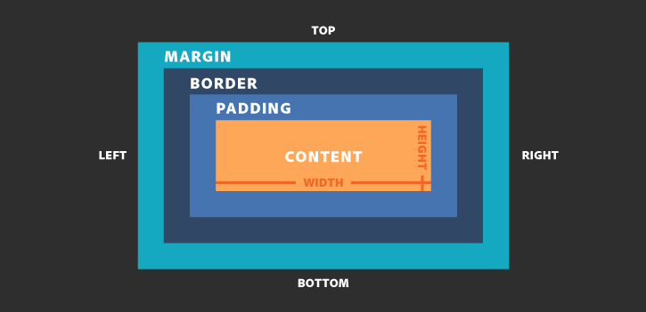

# Поток документа

Два основных типа элементов

- блочные
    > Блочные элементы в нормальном потоке располагаются друг под другом, всегда занимая всю доступную ширину родителя. Высота блочного элемента по умолчанию равна высоте его содержимого.
- строчные
    > Строчные элементы располагаются друг за другом, как слова в предложении. В зависимости от направления письма в конкретном языке
  
    > Если ширины родителя не хватает, то лишний текст строчного элемента переносится на следующую строку.

---

# div

Элемент `<div>` группирует или оборачивает другие элементы и семантически ничего не значит. Сам по себе `<div>` без стилей ничего из себя не представляет — пользователь увидит пустое место на экране.

Можно представить этот тег как универсальную коробку. В неё можно положить что угодно или не класть ничего и просто оформить как нужно.

```html
<body>
    <div>Заголовок документа HTML5</div>
    <div>Текст документа HTML5</div>
</body>
```

> `div` создает блок, который по умолчанию растягивается по всей ширине браузера, а следующий после `div` элемент переносится на новую строку

---

# header


Контейнер `<header>` чаще всего используется для создания шапки сайта. 

Шапка сайта — это блок с вводной информацией, там обычно находятся логотип, строка поиска, меню, кнопки соцсетей или другие ключевые элементы.

Как правило, шапка находится сверху и выглядит одинаково на всех страницах сайта. Она помогает вернуться на главную страницу или попасть в нужный раздел, если в ней есть кнопки меню.

```html
<header>
  
  <nav>
    <a href="#">Мои работы</a>
    <a href="#">Мои навыки</a>
    <a href="#">Контакты</a>
  </nav>
</header>
```

---

# footer

Контейнер `<footer>` создаёт нижнюю часть страницы или блока — «подвал». Обычно здесь находятся контакты, ссылки на разделы сайта, копирайт.

```html
<footer>
    <p>Ольга Сасквоч</p>
    <p>Почта: <a href="mailto:sasquatch@yandex.ru">sasquatch@yandex.ru</a>.</p>
  </footer>
```
Как правило, у сайта есть «шапка» и «подвал»: верхняя и нижняя части страницы. Обычно эти блоки выглядят одинаково на всех страницах. Эти разделы помогают пользователю сориентироваться и получить основную инфу о сайте.

В подвале мы чаще всего видим название компании, правовую информацию, ссылки на соцсети и другие контакты.

`<footer>` может быть не только у всего сайта целиком, но и у отдельного блока или секции.

---

# main

В блоке `<main>` лежит главное содержимое страницы: тот основной и уникальный контент, который относится к главной теме страницы.

```html
<header>Сайт об архитекторах Санкт-Петербурга</header>

<main>
  <h1>Несколько фактов о Растрелли</h1>
  <p>Франческо Растрелли — российский архитектор итальянского происхождения.</p>
  <p>Он был ярким представителем елизаветинского барокко.</p>
</main>

<footer>Подписывайтесь на нас в Инстаграме</footer>
```

Тег `<main>` помогает собрать самую важную информацию на странице в одном контейнере. `<main>` — один из ориентиров (landmark), к которому скринридер может удобно перейти. Также <main> считают основным содержимым встроенные в браузеры режимы для чтения: они отбрасывают ваши стили и прячут всё остальное, кроме главного контента.

В `<main>` помещают главное содержимое — то, которое больше нигде не повторяется на сайте. Соответственно, второстепенные элементы сюда не входят: шапка сайта, подвал, боковые панели, ссылки навигации, информация об авторских правах, логотипы сайта и поисковые формы, как правило, остаются вне контейнера `<main>`.

---

# div против семантических блоков

`<div>` — это универсальный блок, не несущий семантического смысла. По внешнему виду и поведению очень похож на семантические элементы: `<header>, <main>, <footer> и другие`. 

> Если вы можете использовать семантический элемент и подсказать браузеру, что именно там находится, лучше использовать подходящий элемент, а не `<div>`.

---

# другие семантические блоки

- `<aside>` размечает блок с дополнительным содержимым. Он может не иметь отношения к главному (`<main>`) контенту сайта. Часто используется для боковой колонки на сайте.
- `<article>` обозначает законченный и самодостаточный раздел документа, описывающий какую-то сущность: статью, товар, карточку пользователя и т. д.
- `<section>` создаёт независимый блок — например, блок новостей, блок с контактами или просто абзац с заголовком.
- `<nav>` блок в котором размещаются ссылки для навигации по сайту.

---

# Box model

> Каждый элемент на веб-странице — это прямоугольник



Блочная модель состоит из нескольких CSS-свойств, влияющих на размеры элемента:

- `width` — ширина элемента;
- `height` — высота элемента;
- `padding` — внутренние отступы от контента до краёв элемента;
- `border` — рамка, идущая по краю элемента;
- `margin` — внешние отступы вокруг элемента.

> По умолчанию элементы с блочным отображением `(display: block)` занимают всю ширину родителя, если явно не задано другое. А вот высота элемента подстраивается под контент.

> Элементы со строчным `(display: inline)` или строчно-блочным `(display: inline-block)` отображениями по умолчанию подстраивают и ширину, и высоту под вложенный контент. 

---

# CSS

Весь CSS состоит из однотипных блоков — CSS-правил. Каждое правило состоит из как минимум одного селектора и одной пары свойство-значение.

```css
h2 {
  color: #32a846;
}

```
CSS-правило состоит из нескольких обязательных элементов:

- селектор;
- свойство;
- значение.

Можно написать правило сразу для нескольких селекторов, перечислив их через запятую:

```css
.first-selector,
.next-selector {
  color: #6e4aff;
}
```

---

# Селектор по тегу

Селектор по тегу находит элемент на странице по имени тега.

```html
<p>Собираясь в отпуск, нужно <span>не забыть</span>:</p>
<ul>
  <li>взять носки;</li>
  <li><span>взять документы</span>;</li>
  <li>взять топор.</li>
</ul>
<p>И выделить в списке <span>самое главное</span>.</p>
```

```css
span {
  background-color: #2E9AFF;
}
```

---

# Селектор по классу

Селектор по классу находит элемент на странице по значению атрибута `class`.

```html
<h2 class="article-title">Нобелевская премия по физике 2020 года</h2>
<h3 class="article-title">Шнобелевская премия 2020</h3>
```

```css
.article-title {
  margin-bottom: 1.6em;
}
```

---

# Селектор по идентификатору

Селектор по идентификатору находит на странице элемент, которому задан атрибут `id` с конкретным значением.

```html
<p id="first" class="paragraph">Какой-то текст</p>
<div id="second">Красивый блок</div>
<form id="last" action="" method="get"></form>
```

```css
#first {
  color: red;
}

#last {
  border: 2px solid green;
}
```

---

# Селектор потомка

Цепочка перечисленных через пробел селекторов обозначает вложенность от родительских элементов к потомку. Это позволяет управлять стилями вложенных элементов.

```html
<div class="wrapper">
  <!-- Абзац текста на странице -->
  <p class="text">Если вам скажут...</p>

  <div class="news-card">
    <h2 class="news-card__title">Все новости должны быть такими</h2>
    <!-- Абзац текста внутри новостной карточки -->
    <p class="text news-card__text">
      У пингвинов, живущих в Московском зоопарке...
    </p>
</div>
</div>
```

```css
.news-card .text {
  color: #000000;
}
```

---

# Цвета

### По имени

Самый простой способ указания цвета в вебе — ключевые слова. Используются английские названия цветов. Самые популярные базовые цвета:

- Чёрный `black`
- Белый `white`
- Красный `red`
- Зелёный `green`
- Синий `blue`
- 
### RGB

Для задания цвета используется функция `rgb()`, например, `rgb(0 63 255)` для синего. Каждое из трёх значений отвечает за отдельный канал RGB и может быть записано числом от 0 до 255 или в процентах.

### HEX

Шестнадцатеричный код цвета в цветовой модели RGB, который начинается с `#`, например, `#ff0000`

```css
.selector {
  color: rgb(0 63 255);
  border-color: #00000080;
  background-color: red;
}
```

---

# Единицы измерения 

Абсолютные величины ни от чего не зависят и привязаны к физическим единицам измерения: дюймам или сантиметрам.

Экраны мониторов раньше были примерно одинаковые, и оказалось, что одному дюйму на экране соответствуют 72 экранных точки. Именно это соотношение зафиксировано в единице измерения pt. С развитием технологий улучшались экраны и их разрешение, в один дюйм стало умещаться 96 точек, и это было зафиксировано в px.

- `px` соответствуют пикселям на экране. 1px интерпретируется как 1/96 дюйма.
- `cm` — сантиметры. 1cm = 96px / 2.54.
- `in` — дюймы. 1in = 96px = 2.54cm.
- `mm` — миллиметры. 1mm = 1/10cm.
- `Q` — четверть миллиметра. 1Q = 1/40cm.
- `pc` — пики. 1pc = 1/16in.
- `pt` — пункты. 1pt = 1/72in.

---

# Проценты

Используются, чтобы указать, что значение представляет собой долю от другой величины. Исходное значение, от которого берётся часть, может относиться как к самому элементу, так и к его предку. Всё зависит от того, для какого свойства мы применяем проценты.

Например, при указании `width: 50%` ширина элемента будет высчитана как 50% (половина) от ширины родителя. Но если мы укажем в процентах положение фона background-position-x: 30%, это значение будет высчитано относительно ширины самого элемента.

---

# rem, em

`em` - задаёт размер относительно величины шрифта родительского элемента (от ephemeral unit — «относительная единица измерения»)
`rem` - задаёт размер относительно величины шрифта корневого элемента <html> (от root ephemeral unit — «главная относительная единица»)

```css
.selector {
  width: 10em;
}

.selector {
  margin: 5rem;
}

```

---

# vw, vh, vmin, vmax

Это относительные единицы измерения. Все они задают размер относительно размеров окна браузера `(viewport)`, то есть видимой части документа.

```css
div {
  min-width: 30vw;
  height: 50vh;
}
```
> `1vh` = `1% высоты вьюпорта`

---

# background-color

При помощи свойства `background-color` можно задать цвет фона элемента. Задать фоновый цвет можно любому элементу

```css
.block {
  background-color: pink;
}
```

---

# color

Свойство `color` задаёт цвет текста.

```css
.element {
  color: currentColor;
}

```

---

# width

Свойство `width` отвечает за ширину элемента. С его помощью мы можем увеличивать или уменьшать ширину строчно-блочных `(inline-block)` и блочных `(block)` `элементов. На строчные элементы это свойство не будет иметь никакого влияния.

```css
div{
  width: 100px;
}
```

---

# height

> Любой HTML-элемент сам по себе по высоте равен нулю.

Обычно элементы подстраиваются по высоте под то количество контента, которое лежит у него внутри

При помощи свойства `height` можно задать высоту любому блочному `(block)` или строчно-блочному `(inline-block)` элементу.

```css
.container {
  /* высота родителя */
  height: 150px;
  padding: 25px;
  background-color: #AFC9DA;
}

.item {
  /* высота вложенного блока */
  height: 50px;
  margin: 0 10px;
  background-color: #FFFFFF;
}

```

---

# padding

Свойство `padding` — или внутренний отступ — позволяет оттолкнуть контент от границ родительского элемента.

Само свойство `padding` это шорткат, позволяющий задать отступы сразу со всех четырёх сторон.

Можно управлять отступами по отдельности при помощи свойств `padding-top`, `padding-left`, `padding-right`, `padding-bottom`.

В качестве значения можно указать одно, два, три или четыре числа. Браузер будет читать это значение по-разному в зависимости от количества указанных значений.

- `padding: 10px 15px 20px 30px` — читается по часовой стрелке начиная с верхней границы. Сверху 10 пикселей —> справа 15 пикселей —> снизу 20 пикселей —> слева 30 пикселей. Все вычисления в вебе начинаются от верхнего левого угла. Запомни этот порядок. Он часто нужен при чтении кода.
- `padding: 15px` — со всех четырёх сторон будет одинаковый отступ в 15 пикселей.
- `padding: 15px 20px` — парные противоположные отступы. Первое значение для верхнего и нижнего отступов: сверху и снизу по 15 пикселей. Второе значение для боковых отступов: справа и слева по 20 пикселей.
- `padding: 10px 5px 25px` — первое значение для верхнего отступ (сверху 10 пикселей), второе значение для боковых отступов (справа и слева по 5 пикселей), последнее значение для нижнего отступа (снизу 25 пикселей).

---

# margin

Задаёт размер внешнего отступа вокруг элемента.

Чтобы сделать отступ только с одной стороны, используй `margin-top` (сверху), `margin-right` (справа), `margin-bottom` (снизу) или `margin-left` (слева).

> Значение margin может выражаться в пикселях (px), процентах (%) или словом auto, а также в любых других доступных в вебе единицах измерения.

```css
.selector {
  margin: 2px 1em 0 auto;
}
```
