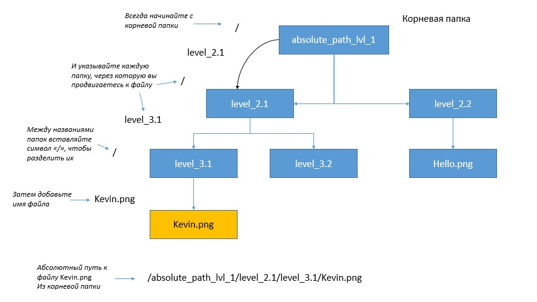
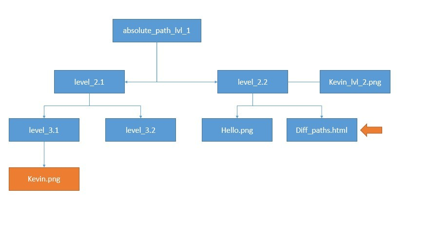

# Полный и относительный путь к файлу

> Путь может быть абсолютный и относительный.


### Чем отличаются абсолютный и относительный пути

Это очень просто. Если путь указывается от корня системы, то это путь абсолютный. Это как почтовый адрес в реальной жизни - откуда бы ты не шел, но по точному адресу ты всегда точно найдешь нужное место.

Если в начале пути корень не указать, то этот путь будет относительным, и он достраивается от текущего положения. В реальной жизни это напоминает дорогу к винному магазину - "два квартала налево и там все время прямо". Дойти по такому пути можно только из конкретной точки. Из другой ты попадешь уже в совсем другое место.

---

# Полный путь

`Абсолютный путь` — это путь от корневой папки к файлу.

Путь состоит из всех папок, которые нам надо просмотреть, разделенных через слеш.



```text
/absolute_path_lvl_1/level_2.1/level_3.1/Kevin.png  //linux/unix
D:/absolute_path_lvl_1/level_2.1/level_3.1/Kevin.png //window
```

---

# Относительный путь

`Относительный путь` — это путь, указывающая на другие папки относительно того где мы уже находимся.

Если опускаем вниз по папкам, разделяем также через `«/»`. Если надо подняться на уровень выше, пишем `«..»`



---

# Осноные консольные команды

- `help` Справка
- `dir` Показать содержимое текущей папки 
- `имя файла.txt` - открыть файл в текущей папке, введите его полное имя с расширением.
- `cd` - перейти в указанную папку
    - `cd ..` Перейти на одну папку вверх
    - `cd d:` Перейти в папку на другом диске
    - ` c: или d:` Изменить диск
- `mkdir` Создать папку
- `rmdir` Удалить папку
- `tree` Показать дерево папок
- `del` Удаление файла
- `ren` Переименование файла 

# Git

`Git` — распределённая система управления версиями. Проект был создан Линусом Торвальдсом для управления разработкой ядра Linux, первая версия выпущена 7 апреля 2005 года. 

`Git` — абсолютный лидер по популярности среди современных систем управления версиями

`Git` применяется для управления версиями в рамках колоссального количества проектов по разработке ПО, как коммерческих, так и с открытым исходным кодом.

`Git` нередко критикуют за сложность освоения: одни термины могут быть незнакомы новичкам, а другие — иметь иное значение.

---

# Создание нового репозитория

```bash
git init
```

Как мы отметили ранее, `git` хранит свои файлы и историю прямо в папке проекта. Чтобы создать новый репозиторий, нам нужно открыть терминал, зайти в папку нашего проекта и выполнить команду `init`. Это включит приложение в этой конкретной папке и создаст скрытую директорию `.git`, где будет храниться история репозитория и настройки.

```bash
mkdir Desktop/git_exercise/
cd Desktop/git_exercise/
git init
```

---

# Определение состояния

```bash
git status
```

`status` — это еще одна важнейшая команда, которая показывает информацию о текущем состоянии репозитория: актуальна ли информация на нём, нет ли чего-то нового, что поменялось, и так далее. 

```bash
git status
On branch master
Initial commit
Untracked files:
(use "git add ..." to include in what will be committed)
hello.txt
```

---

# Подготовка файлов

```bash
git add
```

`add` добавляет файлы в проект, для дальнейшего отслеживания

Добавление одного файла
```bash
git add hello.txt
```
Добавление всех файлов директории

```bash
git add -A 
```
Вносит в индекс все изменения, включая новые файлы:

```bash
git add .
```
---

# Фиксация изменений

`commit` представляет собой состояние репозитория в определенный момент времени. Это похоже на снапшот, к которому мы можем вернуться и увидеть состояние объектов на определенный момент времени.

Чтобы зафиксировать изменения, нам нужно хотя бы одно изменение отслеживаемых файлов

```bash
git commit -m "Initial commit."
```

---

# История

`log` получение списка произведенных изменений

```bash
git log
```

---

# Удаленные репозитории

Чтобы загрузить что-нибудь в удаленный репозиторий, сначала нужно к нему подключиться.

```bash
git remote add origin адрес_удаленного_репозитория
```

> Проект может иметь несколько удаленных репозиториев одновременно. Чтобы их различать, им дают разные имена. Обычно главный репозиторий называется `origin`.

--- 

# Отправка изменений на сервер

`push` отправляет все наши изменения не удаленный репозиторий

Она принимает два параметра: имя удаленного репозитория (`origin`) и ветку, в которую необходимо внести изменения (`main` (`master`) — это ветка по умолчанию для всех репозиториев).

```bash
git push origin master

```
> В зависимости от сервиса, который вы используете, вам может потребоваться аутентифицироваться, чтобы изменения отправились.

---

# Клонирование репозитория

`clone` создание полной копии удаленного репозитория

```bash
 git clone адрес_удаленного_репозитория
```

---

# Запрос изменений с сервера

`pull` получение всех изменений с удаленного репозитория

```bash
git pull origin main
```

---

# Исправление коммита

- `commit --amend` Эта команда добавит все из последнего коммита в область подготовленных файлов и попытается сделать новый коммит. Если вы опечатались в комментарии или забыли добавить файл и заметили это сразу после того, как закоммитили изменения

- `revert` Эта команда создаст коммит, отменяющий изменения, совершенные в коммите с заданным идентификатором. Самый последний коммит может быть доступен по алиасу `HEAD`
```bash
git revert HEAD
```

> Для остальных можно использовать идентификаторы:

```bash
git revert b10cc123
```

# .gitignore

В большинстве проектов есть файлы или целые директории, в которые мы не хотим (и, скорее всего, не захотим) коммитить. Мы можем удостовериться, что они случайно не попадут в `git add -A` при помощи файла `.gitignore`

- Создайте вручную файл под названием `.gitignore` и сохраните его в директорию проекта.
- Внутри файла перечислите названия файлов/папок, которые нужно игнорировать, каждый с новой строки.
- Файл `.gitignore` должен быть добавлен, закоммичен и отправлен на сервер, как любой другой файл в проекте.

# ui

[git ui ](https://git-scm.com/downloads/guis)

- GitHub Desktop
- SourceTree
- Git Extensions

# task

