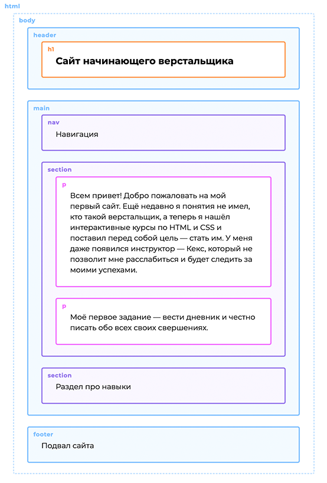

---

# Исправление коммита

- `commit --amend` Эта команда добавит все из последнего коммита в область подготовленных файлов и попытается сделать новый коммит. Если вы опечатались в комментарии или забыли добавить файл и заметили это сразу после того, как закоммитили изменения

- `revert` Эта команда создаст коммит, отменяющий изменения, совершенные в коммите с заданным идентификатором. Самый последний коммит может быть доступен по алиасу `HEAD`
```bash
git revert HEAD
```

> Для остальных можно использовать идентификаторы:

```bash
git revert b10cc123
```

# .gitignore

В большинстве проектов есть файлы или целые директории, в которые мы не хотим (и, скорее всего, не захотим) коммитить. Мы можем удостовериться, что они случайно не попадут в `git add -A` при помощи файла `.gitignore`

- Создайте вручную файл под названием `.gitignore` и сохраните его в директорию проекта.
- Внутри файла перечислите названия файлов/папок, которые нужно игнорировать, каждый с новой строки.
- Файл `.gitignore` должен быть добавлен, закоммичен и отправлен на сервер, как любой другой файл в проекте.

# ui

[git ui ](https://git-scm.com/downloads/guis)

- GitHub Desktop
- SourceTree
- Git Extensions

# task

