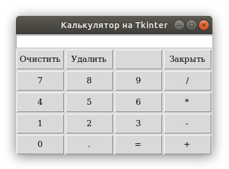

# Теория

- [Модуль pickle](https://pythonworld.ru/moduli/modul-pickle.html)
- [Scope](https://python-scripts.com/scope)
- [Tkinter - 1](https://python-scripts.com/tkinter)
- [Tkinter - 2](https://pythonru.com/uroki/obuchenie-python-gui-uroki-po-tkinter)
- [Tkinter - 3](https://younglinux.info/tkinter/tkinter)
- [Tkinter - 4](https://ru.wikiversity.org/wiki/%D0%9A%D1%83%D1%80%D1%81_%D0%BF%D0%BE_%D0%B1%D0%B8%D0%B1%D0%BB%D0%B8%D0%BE%D1%82%D0%B5%D0%BA%D0%B5_Tkinter_%D1%8F%D0%B7%D1%8B%D0%BA%D0%B0_Python)

# Задача

Сделать функциональный калькулятор

