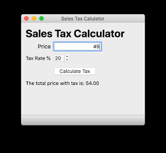

# Теория

- [PyQt](https://pythonworld.ru/gui/pyqt5-firstprograms.html)
- [pyqt сигналы](https://pythonworld.ru/gui/pyqt5-eventssignals.html)
- [dialog](https://pythonworld.ru/gui/pyqt5-dialogs.html)
- [dialog example](https://coderlessons.com/tutorials/python-technologies/izuchite-pyqt/pyqt-klass-qdialog)
- [table widget](https://evileg.com/ru/post/236/)

# Задача

Написать программу расчета налога

# Задача

Разобраться с проектом [https://github.com/msheiko/todo-python](https://github.com/msheiko/todo-python)

- установить
- запустить
- изучить код
