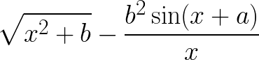
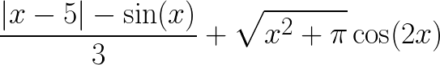
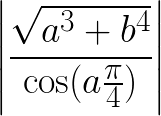

# Теория
- [Переменные и типы данных](https://metanit.com/python/tutorial/2.2.php)
- [Переменные - 2](https://younglinux.info/python/variable)
- [Ввод и вывод](https://younglinux.info/python/input)
- [Операции с числами](https://metanit.com/python/tutorial/2.3.php)
- [Операции со строками](https://metanit.com/python/tutorial/2.5.php)
- [Условные выражения](https://metanit.com/python/tutorial/2.4.php)
- [Логические выражения и операторы](https://younglinux.info/python/operators)
- [Условная конструкция if](https://metanit.com/python/tutorial/2.6.php)
- [if - 2](https://pythonworld.ru/osnovy/instrukciya-if-elif-else-proverka-istinnosti-trexmestnoe-vyrazhenie-ifelse.html)
- [if - 3](https://younglinux.info/python/if)
- [Циклы](https://metanit.com/python/tutorial/2.7.php)
- [Циклы 2](https://younglinux.info/python/while)
- [Циклы 3](https://pythonworld.ru/osnovy/cikly-for-i-while-operatory-break-i-continue-volshebnoe-slovo-else.html)
- [turtle](https://digitology.tech/docs/python_3/library/turtle.html) * просто список всех функций, читать не нужно

# Задача 1

Вычислите значение выражений

 

при a=0.1, b=0.2 и x=1

 

при x=45

 

при a=5, b=1.2

# Задача 2
# Задача 3
# Задача 4
# Задача 5
# Задача 6
# Задача 7
# Задача 8
# Задача 9
